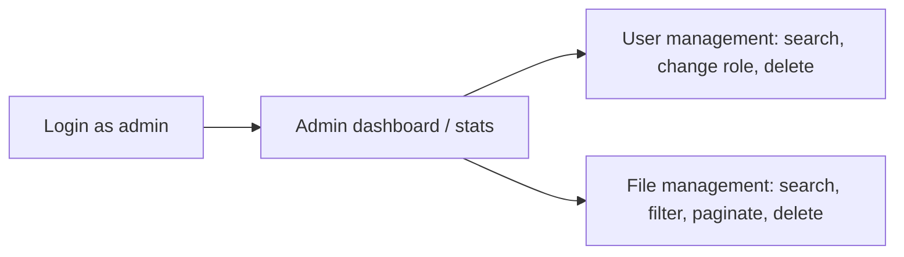

# 01 — Product Requirements Document (PRD)

## 1. Product overview

**Managing Your Files** is a full-stack web application that lets registered, email-verified users securely upload, organise, search and inspect their own files, and lets administrators manage all users and files and monitor system usage. It is built for a Full Stack Developer hiring assessment with an 8–10 hour budget, so scope is deliberately focused on the mandatory feature set with a clean, production-minded architecture.

## 2. Problem statement

People need a simple, secure place to store documents and images, find them again quickly, and understand what they have. Generic cloud drives are heavy and over-featured for a focused workflow. Operators of such a system also need lightweight administration — the ability to see who is using it, how much storage is consumed, and to remove abusive content or accounts. This product delivers that core loop: **authenticate → upload → manage → understand → administer**.

## 3. Product goals

1. Let a verified user upload files (single, multiple, drag-and-drop) with clear validation and progress.
2. Let a user find and understand files via search, filter, sort, pagination, details and extracted content.
3. Give users insight through personal statistics dashboards.
4. Give admins control over users and files plus system-wide statistics.
5. Enforce security and correct authorization on the backend.

## 4. Business goals

- Demonstrate senior-level full-stack competence within the time budget.
- Showcase clean architecture, type safety, sensible security, and good UX.
- Ship something genuinely runnable and deployable, not a mock-up.

## 5. Target users & personas

| Persona | Role | Needs | Pain today |
|---|---|---|---|
| **Nadia** — individual user | USER | Upload and retrieve documents/images fast; trust that only she sees them. | Cluttered, slow generic drives. |
| **Omar** — power user | USER | Bulk upload, search by name/content, sort by size/date. | Manual organisation. |
| **Sara** — administrator | ADMIN | Oversee users and files, reclaim storage, remove bad content. | No visibility / no controls. |

## 6. Core user journeys

**New user journey**

**Returning user journey**: Login → My Files (search/filter/sort/paginate) → upload or delete → dashboard.

## 7. Admin journey

## 8. Main features

- Authentication: register, OTP verify, resend, login, logout, profile, JWT (cookie), RBAC.
- Files: upload (multi + drag-drop + progress + validation), list (search/filter/sort/paginate), details + extracted content, delete, download/preview (P1).
- Statistics: user dashboard + admin dashboard (Recharts).
- Admin: user management, all-files management, system stats.

## 9. Functional scope (P0)

All P0 items in `02` §6. Summarised: complete auth+RBAC, file CRUD with validation and extraction, user & admin statistics, admin user/file management, consistent API + error handling.

## 10. Non-functional scope

Security (hashing, cookie JWT, file validation), responsive UI with loading/empty/error states and toasts, paginated indexed queries, typed layered code (`06`).

## 11. MVP definition

The MVP is exactly the **P0 set**:

- Register → OTP verify → resend → login → logout → profile.
- Backend JWT auth (httpOnly cookie) + USER/ADMIN RBAC enforced server-side.
- Upload (single/multiple/drag-drop/progress/validation) → store → extract text → persist metadata.
- My Files: list + search + filter + sort + pagination + details (with extracted content) + delete, all ownership-scoped.
- User stats endpoint + dashboard (4 metrics/charts).
- Admin: users list/search/role/delete, all-files list/search/filter/paginate/delete, admin stats + dashboard.
- Responsive UI, toasts, error handling; deployed frontend + backend + DB; README.

The MVP is realistic within 8–10 hours (time plan in `27`).

## 12. Enhanced scope (P1)

Download/preview streaming, image/text preview, rate limiting, health check, CSRF hardening, `tokenVersion` invalidation, structured logging, accessibility polish.

## 13. Bonus scope (P2)

Dark mode, folder management, soft delete, audit logs, refresh tokens, Docker, duplicate-detection UI, profile edit/password change, frontend unit tests.

## 14. Out-of-scope (P3)

Advanced OCR of images, complex folder hierarchies, file sharing/collaboration, real-time editing, microservices, event-driven infrastructure, multi-region, billing. Detailed rationale in the out-of-scope analysis (`27` appendix / `30`).

## 15. Success criteria

- All P0 requirements demonstrably work in production.
- Backend rejects unauthorized/cross-owner access (verified by tests).
- Uploads validate, store, extract, and appear in My Files.
- Dashboards render real aggregated data.
- Frontend + backend + DB deployed and reachable; README complete.

## 16. Assumptions

Consolidated in `30`. Key ones: PostgreSQL on Neon; 10MB/5-file limits; text/pdf/docx extraction only; httpOnly cookie JWT (reviewer-locked); Recharts (reviewer-locked); hard delete + cascade; **Cloudinary blob storage** (ADR-039); `/api` prefix.

## 17. Risks

| Risk | Impact | Mitigation |
|---|---|---|
| Cloudinary quota exhausted or credentials invalid | Uploads fail | Free tier is 25 GB, far above assessment volume; credentials validated at boot (ADR-039). |
| Gmail SMTP blocked / app password issues | OTP emails fail | Console fallback in dev; document app-password setup. |
| Cross-origin cookie misconfig (SameSite/Secure) | Auth breaks in prod | Explicit CORS + cookie recipe in `24`; test end-to-end. |
| Scope creep into bonuses | P0 unfinished | Strict P0-first ordering (`27`). |
| Extraction library edge cases | Slow/failing uploads | Non-blocking extraction, FAILED status, size cap (ADR-005/006). |

## 18. Constraints

Fixed tech stack (CON-01/02), 8–10h budget (CON-03), modular monolith (CON-04), backend-authoritative security (CON-05), specified hosting (CON-06).
