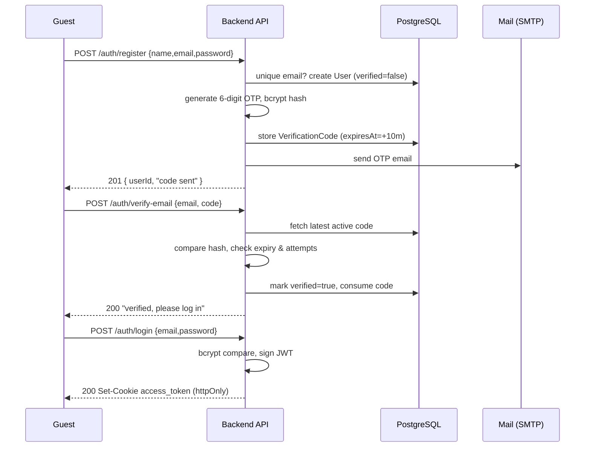
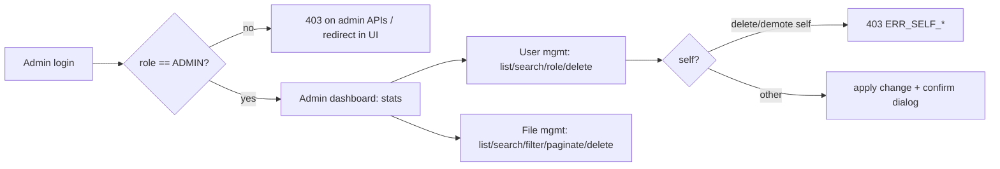
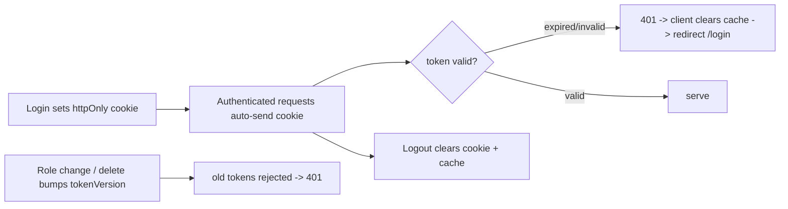

# 03 — Business Flow

End-to-end lifecycles including failure scenarios. Ties requirement IDs (`02`) and decisions (`30`) to observable behaviour.

## 1. Registration & activation lifecycle



Steps map to AUTH-001 → AUTH-005.

### Failure scenarios

| Point | Failure | Behaviour |
|---|---|---|
| Register | Duplicate email | 409 `ERR_EMAIL_TAKEN`. |
| Register | Weak/invalid input | 400 `ERR_VALIDATION` with field details. |
| Register | Email send fails | User still created; client told code sent; user can resend. Error logged. |
| Verify | Wrong code | 400 `ERR_OTP_INVALID`, `attempts++`. |
| Verify | Expired code | 400 `ERR_OTP_EXPIRED`; prompt resend. |
| Verify | >5 attempts | 429 `ERR_OTP_ATTEMPTS`; must resend for a new code. |
| Resend | Within 60s | 429 `ERR_OTP_COOLDOWN`. |
| Resend | >5/hour | 429 `ERR_OTP_RESEND_LIMIT`. |
| Login | Unverified | 403 `ERR_EMAIL_NOT_VERIFIED`. |
| Login | Bad creds | 401 `ERR_INVALID_CREDENTIALS` (generic). |

## 2. File lifecycle

```mermaid
flowchart TD
  U[User selects/drops files] --> CV[Client validation: type/size/count]
  CV -->|invalid| CVE[Toast error, block]
  CV -->|valid| UP[Axios multipart upload + progress]
  UP --> SV[Server validation: ext + MIME + magic bytes + size]
  SV -->|invalid| RF[Add to failed[], cleanup temp]
  SV -->|valid| ST[StorageService writes uuid blob]
  ST --> EX[Extraction: text/pdf/docx]
  EX -->|ok| PDok[Persist metadata + extractedContent, status=DONE]
  EX -->|fail| PDf[Persist metadata, status=FAILED, content=null]
  EX -->|image/unsupported| PDs[Persist metadata, status=SKIPPED]
  PDok --> RESP[201 uploaded[] / failed[]]
  PDf --> RESP
  PDs --> RESP
  RESP --> INV[React Query invalidates files + user stats]
  INV --> LIST[My Files updates]
  LIST --> DET[View details / preview]
  DET --> DEL[Delete: remove row + blob]
```

Steps map to FILE-001 → FILE-016, ADR-004/005/006.

### Failure scenarios

| Point | Failure | Behaviour |
|---|---|---|
| Client | Oversized/blocked type | Blocked before upload; toast. |
| Server | MIME spoof (ext ≠ magic bytes) | 415/failed entry; blob not persisted. |
| Storage | Disk write error | File marked failed; no orphan DB row (write blob → then DB row). |
| Extraction | Parser throws | Upload succeeds; status FAILED. |
| DB | Persist error after blob write | Delete the just-written blob (cleanup) then error → consistency (NFR-010). |
| List | No files | Empty state UI. |
| Details | Not owner | 403. |
| Delete | Missing file | 404. |

## 3. Admin lifecycle



Steps map to ADMIN-001 → ADMIN-005, USER-002 → USER-006, STAT-003/004.

### Failure scenarios

| Point | Failure | Behaviour |
|---|---|---|
| Any admin API | Non-admin token | 403 `ERR_FORBIDDEN`. |
| Delete user | Self | 403 `ERR_SELF_DELETE`. |
| Change role | Demote self | 403 `ERR_SELF_DEMOTE`. |
| Delete user | Has files | Cascade deletes files + blobs. |
| Delete file | Already gone | 404. |

## 4. Session lifecycle



Maps to AUTH-005/009/011/013, ADR-007/008/009.
