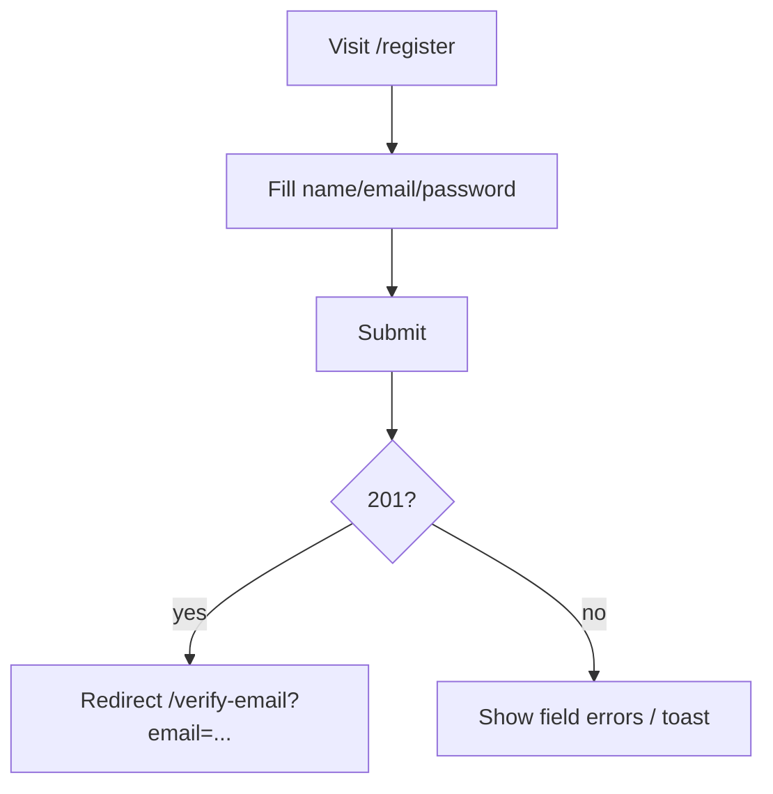
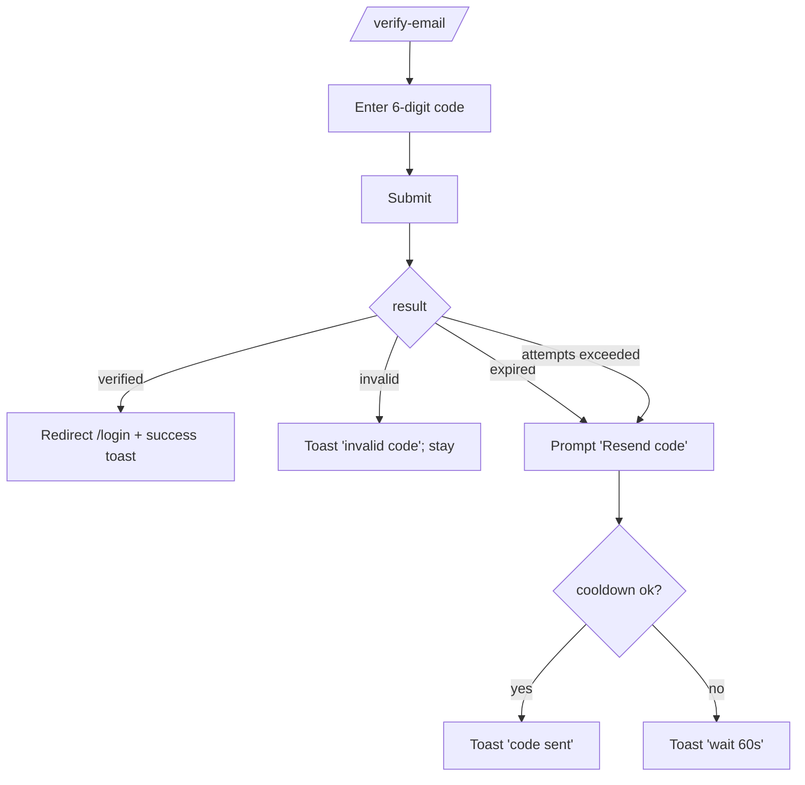
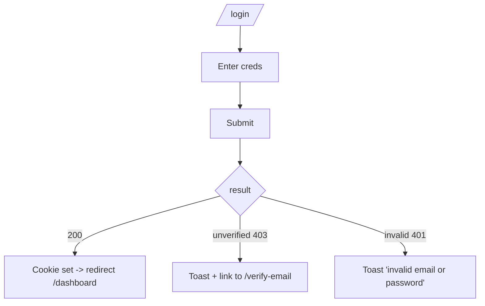
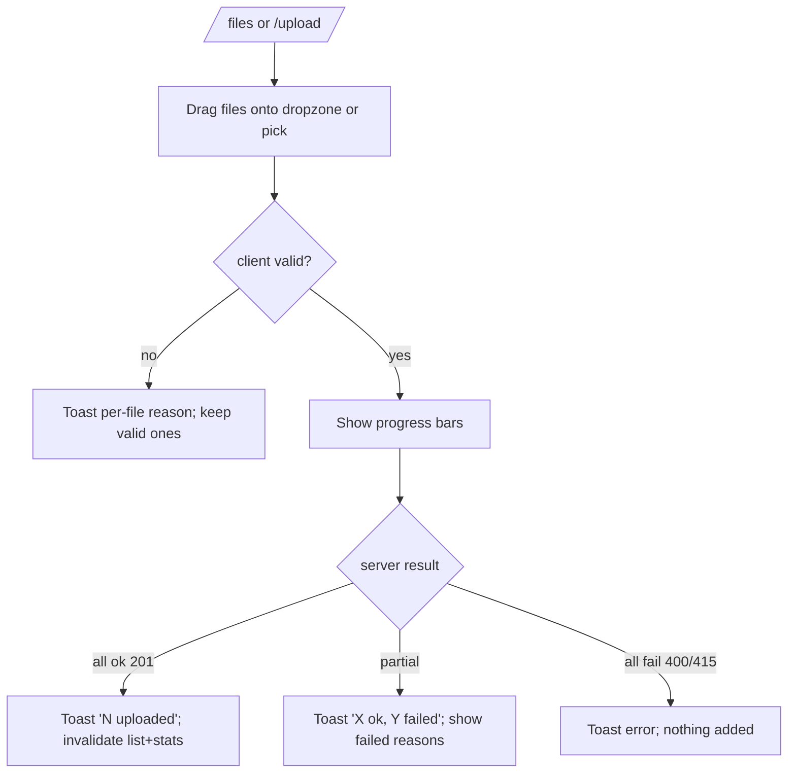
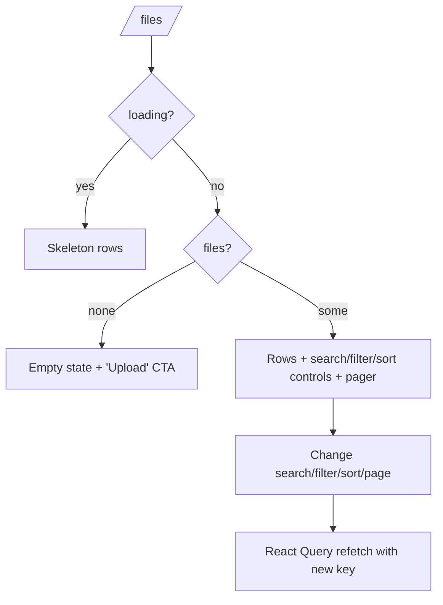
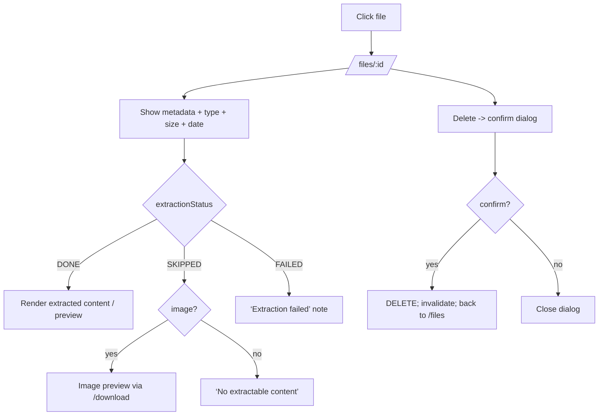
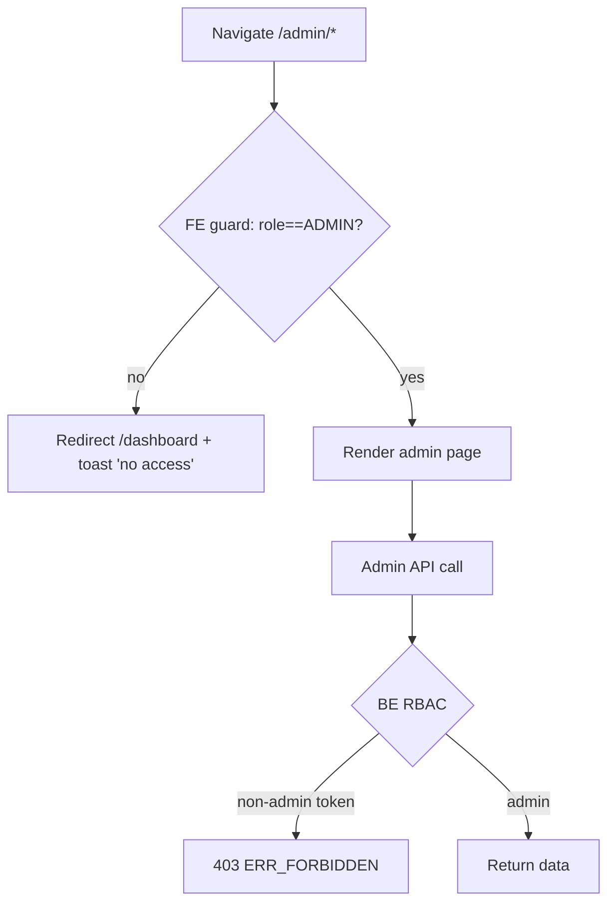
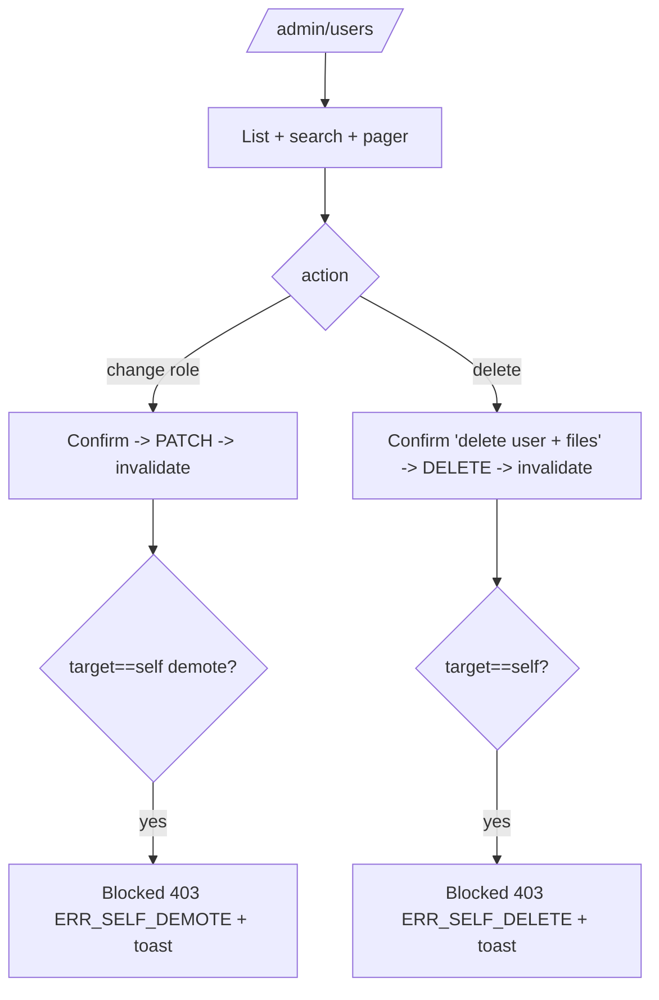

# 04 — User Flows

Detailed flows for Guest, User, and Admin, including happy paths, alternates, and failures. Complements `03` (business lifecycle) with UI-level routing behaviour. Frontend routes are defined in `14`.

## 1. Guest flows

### 1.1 Registration (happy)

### 1.2 Email verification

### 1.3 Login

### 1.4 Guest hitting a protected route

Guest navigates to `/dashboard` or `/files` → Next.js middleware/layout sees no valid session → redirect to `/login?redirect=<path>`. Backend independently returns 401 if an API call is attempted (security boundary).

### Guest empty/edge states

| Situation | Behaviour |
|---|---|
| Already logged in visits /login or /register | Redirect to /dashboard. |
| Unknown email on resend | Generic handling (see `11` note). |
| Network/server down | Global error toast; retry affordance. |

## 2. User flows

### 2.1 Upload (happy + partial failure)

### 2.2 Browse My Files

### 2.3 File details & delete

### 2.4 User dashboard

Load `/dashboard` → React Query `stats/user` → render 4 widgets (total files, storage, type distribution pie, upload-history line, Recharts). Loading → skeleton; error → retry; zero data → friendly empty charts.

### User failure/edge states

| Situation | Behaviour |
|---|---|
| Token expired mid-session | Next 401 → clear cache → redirect /login. |
| Access another user's file URL | 403 → 'Not found or no access' page. |
| Invalid pagination (page beyond range) | Return empty page + meta; UI shows 'no results'. |
| Invalid sort field | Backend ignores, uses default; UI resets control. |
| Empty search | Treated as no filter (all own files). |

## 3. Admin flows

### 3.1 Admin gate

FE guard is UX; BE RBAC is the real boundary (CON-05, `08`).

### 3.2 User management

### 3.3 File management

`/admin/files` → list all files (`scope=all`) with owner column + search + category filter + pager → delete any file (confirm dialog) → invalidate admin files + admin stats.

### 3.4 Admin dashboard

`/admin` → `stats/admin` → total users, total files, storage, top types (bar/pie), recent uploads list. Same loading/empty/error handling.

### Admin failure/edge states

| Situation | Behaviour |
|---|---|
| Non-admin forges request | 403 regardless of FE. |
| Delete last admin (self) | Blocked (ADR-020). |
| Delete user with many files | Cascade; progress/toast on completion. |
| Stats with zero data | Empty charts + zeros. |
