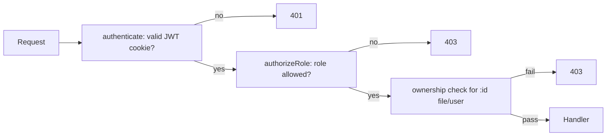

# 08 — Roles & Permissions

Authorization model. **Backend is the security boundary; frontend guards are UX only** (CON-05). Roles: `USER`, `ADMIN` (enum, `09`).

## 1. Role definitions

| Role | Description |
|---|---|
| **Guest** | Unauthenticated. Public endpoints only. |
| **USER** | Verified account. Owns and manages only their own files; views own stats. |
| **ADMIN** | All USER abilities + manage all users and files + system stats. Seeded from env (ADR-019). |

## 2. Permission matrix

| Capability | Guest | USER | ADMIN |
|---|:--:|:--:|:--:|
| Register / verify / resend / login | ✅ | — | — |
| Logout | — | ✅ | ✅ |
| View own profile | — | ✅ | ✅ |
| Upload files | — | ✅ | ✅ |
| List **own** files | — | ✅ | ✅ |
| View **own** file details | — | ✅ | ✅ |
| Delete **own** file | — | ✅ | ✅ |
| Download **own** file | — | ✅ | ✅ |
| View own statistics | — | ✅ | ✅ |
| List **all** users | — | ❌ | ✅ |
| Search users | — | ❌ | ✅ |
| Change user role | — | ❌ | ✅ |
| Delete user | — | ❌ | ✅ |
| List **all** files (any owner) | — | ❌ | ✅ |
| View **any** file details | — | ❌ | ✅ |
| Delete **any** file | — | ❌ | ✅ |
| Download **any** file | — | ❌ | ✅ |
| View admin statistics | — | ❌ | ✅ |
| Delete/demote **self** (admin) | — | — | ❌ (ADR-020) |

✅ allowed · ❌ forbidden (403) · — n/a.

## 3. Resource-level rules

### Files (ownership)

- A USER may act on a file **iff** `file.ownerId === req.user.id`.
- An ADMIN may act on **any** file.
- Enforcement: after auth+RBAC, an ownership check in the files service compares `ownerId`. Failing it → 403 `ERR_FORBIDDEN` (FILE-015).
- Returning 404 vs 403 for another user's file: MVP returns **403** for existing-but-not-owned (clear), and 404 for non-existent. (Security note: some designs return 404 to avoid resource-existence disclosure — documented trade-off in `20`.)

### Users

- Only ADMIN reaches `/users/*`.
- Self-protection: ADMIN cannot delete self (`ERR_SELF_DELETE`) or demote self (`ERR_SELF_DEMOTE`).

## 4. Enforcement layers

| Layer | Where | Enforces | Authority |
|---|---|---|---|
| Frontend route guard | Next.js middleware + layout | hide/redirect admin & protected pages | UX only |
| `authenticate` | Express middleware | valid session | **security** |
| `authorizeRole('ADMIN')` | Express middleware | role gate | **security** |
| Ownership check | Files service | per-resource access | **security** |

**Statement:** Frontend authorization exists solely to improve UX (hiding controls, redirecting). It provides **no security**. Every protected/admin/owner action is independently enforced on the backend and must pass even if the frontend is bypassed.

## 5. Frontend guard behaviour

| Route group | Guest | USER | ADMIN |
|---|---|---|---|
| `/`, `/login`, `/register`, `/verify-email` | visible | redirect → `/dashboard` | redirect → `/dashboard` |
| `/dashboard`, `/files`, `/files/:id`, `/profile` | redirect → `/login` | visible | visible |
| `/admin`, `/admin/users`, `/admin/files` | redirect → `/login` | redirect → `/dashboard` + toast | visible |

## 6. Requirement mapping

| Rule | SRS |
|---|---|
| RBAC on admin routes | AUTH-010, ADMIN-001 |
| Ownership on files | FILE-015 |
| Admin self-protection | USER-006, ADR-020 |
| Frontend guards (UX) | ADMIN-001 |
