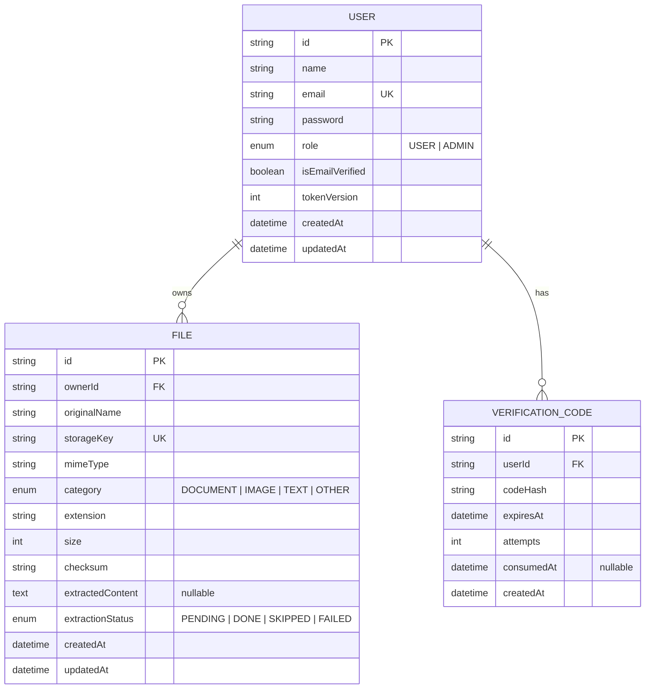

# 10 — Entity Relationship Diagram (ERD)

Visual model of the schema defined in `09`. PostgreSQL via Prisma (ADR-001).

## ERD

## Relationships explained

### User → File (1 : many)

- One `User` owns zero-to-many `File` rows via `File.ownerId`.
- **Ownership is the security boundary**: users read/delete only files where `ownerId = self`; admins bypass this check (FILE-015, `08`).
- **Cascade delete**: removing a user deletes their file rows (ADR-013). Blobs on disk are removed by the service layer because a DB cascade cannot touch the filesystem.
- Optionality: a user may own **zero** files (empty state on My Files, EC catalogue in `29`).

### User → VerificationCode (1 : many)

- One `User` has zero-to-many `VerificationCode` rows via `VerificationCode.userId`.
- Multiple rows exist over time (registration + resends). Only the **latest unconsumed, unexpired** row is valid (ADR-010).
- **Cascade delete**: removing a user deletes their codes.
- History is retained for resend-rate and cooldown checks (`createdAt` window).

### Why no other relationships

- `File` has no link to `VerificationCode` — different lifecycles, no shared concern.
- No folder/tag entities in MVP (folders are P2, ADR/`06`).
- No audit-log entity in MVP (P2).

## Cardinality summary

| From | To | Cardinality | FK | On delete |
|---|---|---|---|---|
| User | File | 1 → 0..N | File.ownerId | Cascade |
| User | VerificationCode | 1 → 0..N | VerificationCode.userId | Cascade |

## Notes for implementation

- All PKs are `cuid()` strings (non-sequential, URL-safe).
- Unique constraints: `User.email`, `File.storageKey`.
- Enums modelled as Prisma enums (native PostgreSQL enums).
- `extractedContent` maps to `TEXT`; all other strings to `VARCHAR`/`TEXT` as Prisma defaults.
