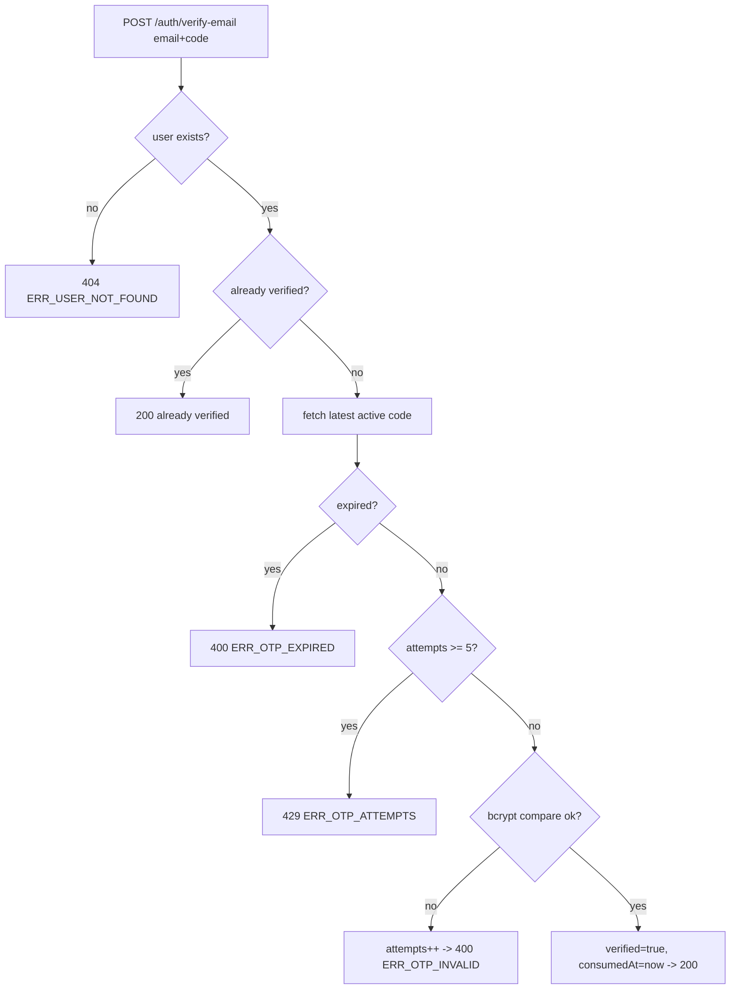
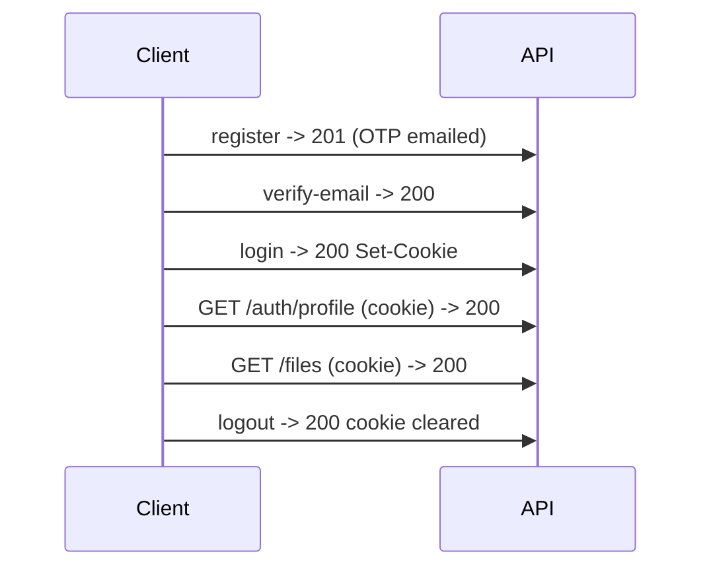

# 12 — Authentication Flow

Authoritative auth design. Decisions: ADR-007 (JWT), ADR-008 (cookie), ADR-009 (logout), ADR-010 (OTP), ADR-011 (email), ADR-018 (bcrypt), ADR-021 (CSRF). API shapes in `11`.

## 1. Registration & password hashing

1. Validate `{name,email,password}` (Zod, `18`).
2. Normalise email to lowercase; check uniqueness.
3. Hash password with **bcrypt cost 12**. Store only the hash.
4. Create `User { isEmailVerified:false, role:USER, tokenVersion:0 }`.
5. Trigger OTP generation (below).

## 2. OTP generation, storage, expiration

| Aspect | Rule |
|---|---|
| Format | 6-digit numeric (`000000`–`999999`), cryptographically random. |
| Storage | bcrypt **hash** of the code in `VerificationCode.codeHash`. Plaintext only in the email. |
| Expiry | `expiresAt = now + 10 min`. |
| Uniqueness | Issuing a new code invalidates prior active codes (consume/delete). |
| Attempts | `attempts` starts 0; incremented per failed verify. |

## 3. OTP verification



## 4. Resend rules (ADR-010)

- Reject if already verified (`ERR_ALREADY_VERIFIED`).
- Reject if newest code age < 60s (`ERR_OTP_COOLDOWN`).
- Reject if ≥5 codes created in last hour (`ERR_OTP_RESEND_LIMIT`).
- Otherwise invalidate prior + create+send new.

## 5. Login & JWT generation

1. Validate credentials; fetch user by email.
2. If not found or bad password → 401 `ERR_INVALID_CREDENTIALS` (generic).
3. If `!isEmailVerified` → 403 `ERR_EMAIL_NOT_VERIFIED`.
4. Sign JWT and set cookie.

### JWT payload (ADR-007)

```json
{ "sub": "<userId>", "role": "USER|ADMIN", "tokenVersion": 0, "iat": 1710000000, "exp": 1710604800 }
```

- Algorithm **HS256**, secret `JWT_SECRET`, expiry **7 days**.

### Cookie (ADR-008)

```
Set-Cookie: access_token=<jwt>; HttpOnly; Secure; SameSite=None; Path=/; Max-Age=604800
```

- `SameSite=None` + `Secure` required for cross-site (Vercel↔Render). Local dev over http uses `SameSite=Lax` + non-Secure via env-driven config (see `24`/`25`).

## 6. Protected routes & middleware

```mermaid
flowchart LR
  R[Request] --> M[authenticate]
  M --> RD[read cookie access_token or Bearer]
  RD --> VF{verify signature+exp}
  VF -->|fail| E401[401 ERR_UNAUTHENTICATED]
  VF -->|ok| TV{tokenVersion matches DB?}
  TV -->|no| E401b[401 ERR_UNAUTHENTICATED]
  TV -->|yes| ATT[req.user = {id, role}] --> NEXT[next]
```

- `tokenVersion` check (AUTH-013, P1) enables invalidation on delete/role change. In pure MVP it can be skipped, but the field is present.

## 7. Role-based authorization

- `authorizeRole('ADMIN')` runs after `authenticate`; compares `req.user.role`. Non-match → 403 `ERR_FORBIDDEN`. (`08`)

## 8. Logout (ADR-009)

- `POST /auth/logout` sets `access_token` cookie with `Max-Age=0` (cleared). Client clears React Query cache and redirects to `/login`.
- Stateless: no server session store. Optional global invalidation via `tokenVersion++`.

## 9. Invalid/expired token behaviour

| Situation | Result |
|---|---|
| No cookie/header | 401 |
| Malformed/invalid signature | 401 |
| Expired | 401 |
| `tokenVersion` mismatch | 401 |
| Valid but role insufficient | 403 |

Frontend: any 401 from an authenticated call → clear cache → redirect `/login?redirect=<path>` (`17`, `19`).

## 10. CSRF mitigation (ADR-021, P1)

- Cookie is `SameSite=None`, so add defence-in-depth:
  - Require custom header `X-Requested-With: fetch` on state-changing requests (cross-site HTML forms cannot set it).
  - Strict CORS origin allow-list with credentials.
- Full double-submit CSRF token deferred (P1+).

## 11. Admin bootstrap (ADR-019)

- Seed script upserts admin from `ADMIN_EMAIL/NAME/PASSWORD`, `role=ADMIN`, `isEmailVerified=true`. Idempotent. Runs post-migrate in deploy (`24`).

## 12. Sequence — end to end


