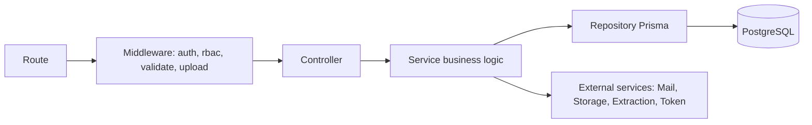
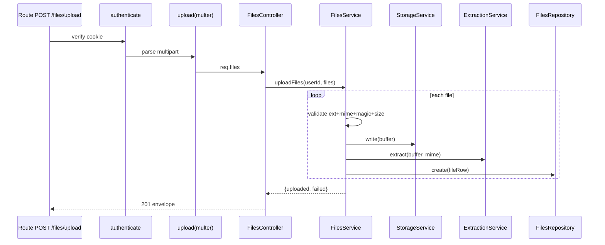

# 15 — Backend Architecture

Express + TypeScript modular monolith (CON-02/04). Layered: **routes → controllers → services → repositories**, with cross-cutting middleware, config, and utilities.

## 1. Layering



| Layer | Responsibility | Must NOT |
|---|---|---|
| Route | Declare method+path, attach middleware, delegate to controller. | contain logic |
| Controller | Parse validated input, call service, shape HTTP response (envelope). | contain business rules or Prisma |
| Service | Business logic, orchestration, authorization decisions, transactions. | touch req/res |
| Repository | Prisma data access, query building. | contain business rules |
| Middleware | auth, rbac, validation, upload, error, rate-limit, logging. | duplicate business logic |
| Utils/lib | pure helpers (hashing, tokens, jwt, sanitisation). | hold state |

## 2. Modules (modular monolith)

```
modules/
  auth/    (routes, controller, service, repository, dto/schemas)
  users/   (routes, controller, service, repository, dto)
  files/   (routes, controller, service, repository, dto)
  stats/   (routes, controller, service, dto)   # read-only aggregations
```

Each module owns its routes/controller/service/repository and Zod schemas. Modules communicate through services, not by reaching into each other's repositories.

## 3. Cross-cutting middleware

| Middleware | Purpose |
|---|---|
| `authenticate` | Verify JWT cookie/Bearer, attach `req.user` (`12`). |
| `authorizeRole(role)` | RBAC gate (`08`). |
| `validate(schema)` | Zod validation of body/query/params → 400 on failure (`18`). |
| `upload` | Multer config (memory, limits, fileFilter) (`13`). |
| `errorHandler` | Central error → envelope + status (`19`). |
| `notFound` | 404 for unknown routes. |
| `rateLimit` | on `/auth/*`, `/files/upload` (P1, SYS-004). |
| `requestLogger` | structured logs (P1, NFR-011). |
| `cors` | credentialed, origin allow-list (ADR-008). |

## 4. External services (single-responsibility)

| Service | Responsibility | Lib |
|---|---|---|
| `TokenService` | sign/verify JWT, cookie options | jsonwebtoken |
| `PasswordService` | bcrypt hash/compare | bcrypt |
| `MailService` | send OTP email; console fallback | nodemailer |
| `StorageService` | upload/stream/remove blobs; abstracts the provider (ADR-039) | cloudinary |
| `ExtractionService` | route by type → text | pdf-parse, mammoth |
| `OtpService` | generate/hash/validate OTP + rate rules | crypto, bcrypt |

## 5. Configuration

```
config/
  env.ts       # validate + type process.env (fail fast if missing)
  prisma.ts    # PrismaClient singleton
  cors.ts      # origin allow-list from env
  constants.ts # limits, allowed types, OTP/JWT settings
```

`env.ts` validates required vars at boot (Zod) and exports a typed `env` object; missing critical vars crash early (`25`).

## 6. Database layer

- Single `PrismaClient` singleton (avoids connection exhaustion).
- Repositories are thin wrappers exposing intention-revealing methods (`findByEmail`, `listByOwner`, `countByCategory`).
- Transactions (`prisma.$transaction`) where multi-step consistency is needed (e.g. user delete + related cleanup coordination).

## 7. Request lifecycle example (upload)



## 8. Error propagation

- Services throw typed `AppError(code, status, message, details?)`.
- Controllers use `try/catch` → `next(err)` or an async wrapper.
- `errorHandler` maps `AppError`→envelope; unknown→500 `ERR_INTERNAL` (logged, message sanitised) (`19`).

## 9. App composition

```
app.ts     # express() + global middleware + mount /api routers + /health + notFound + errorHandler
server.ts  # load env, connect Prisma, listen(PORT)
```

## 10. Testing seams

- Services depend on injected/importable external services → mockable in unit tests.
- Supertest hits the composed `app` for integration/API tests (`23`).
