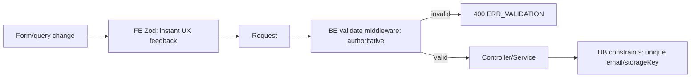

# 18 — Validation Rules

Frontend validation is **advisory** (UX). Backend validation is **authoritative** (`CON-05`). Both use Zod (ADR-017); backend runs on every request via `validate(schema)` middleware.

## 1. Field rules

| Field | Rule | FE | BE |
|---|---|---|---|
| `name` | string, trim, 1–100 chars | ✅ | ✅ (authoritative) |
| `email` | valid email, lowercased, ≤254 | ✅ | ✅ + uniqueness (DB) |
| `password` | ≥8 chars, ≥1 letter, ≥1 digit, ≤72 (bcrypt limit) | ✅ | ✅ |
| `code` (OTP) | exactly 6 digits `^\d{6}$` | ✅ | ✅ |
| `role` | enum `USER` \| `ADMIN` | ✅ | ✅ |
| `id` (params) | non-empty cuid-like string | — | ✅ |
| `search` | string, trim, ≤100; empty = no filter | ✅ | ✅ |
| `category` | enum `DOCUMENT\|IMAGE\|TEXT\|OTHER` | ✅ | ✅ |
| `mimeType` | string, in allowed set | — | ✅ |
| `sortBy` | whitelist per resource | ✅ | ✅ (reject/ignore others) |
| `sortOrder` | `asc` \| `desc`, default `desc` | ✅ | ✅ |
| `page` | int ≥1, default 1 | ✅ | ✅ (coerce) |
| `limit` | int 1–100, default 10 | ✅ | ✅ (clamp) |

Sort whitelists: files `[createdAt, size, originalName]`; users `[createdAt, name, email]`.

## 2. File validation (ADR-002/003, `13`)

| Check | FE | BE |
|---|---|---|
| Count ≤ 5 | ✅ | ✅ (Multer `files:5`) |
| Size ≥ 1 byte (reject empty) | ✅ | ✅ (ADR-042) |
| Size ≤ 10MB/file | ✅ | ✅ (Multer `fileSize`) |
| Total ≤ 50MB | ✅ (sum) | ✅ |
| Extension in allow-list | ✅ | ✅ |
| Declared MIME in allow-list | partial | ✅ |
| Magic-byte match | — | ✅ (`file-type`) |
| UTF-8 decodable (text types) | — | ✅ |
| At least 1 file | ✅ | ✅ |

FE cannot perform magic-byte checks reliably; BE is authoritative for content sniffing.

## 3. Zod schema shapes (conceptual, not code)

- `registerSchema` = { name, email, password }
- `verifyEmailSchema` = { email, code }
- `resendSchema` = { email }
- `loginSchema` = { email, password }
- `updateUserSchema` = { role }
- `listFilesQuerySchema` = { page?, limit?, search?, category?, mimeType?, sortBy?, sortOrder?, scope? }
- `listUsersQuerySchema` = { page?, limit?, search?, sortBy?, sortOrder? }
- `idParamSchema` = { id }

FE reuses the same shape definitions where practical (shared conventions) to keep messages consistent.

## 4. Validation error format

`validate` middleware collects Zod issues → 400 with:

```json
{ "success": false, "error": { "code": "ERR_VALIDATION", "message": "Validation failed", "details": [ { "field": "password", "message": "Must be at least 8 characters" } ] } }
```

FE maps `details[].field` to inline form errors.

## 5. Normalisation

| Input | Normalisation |
|---|---|
| email | trim + lowercase before store/compare |
| name | trim; collapse excess whitespace |
| search | trim; empty → undefined (no filter) |
| originalName | sanitise (strip control chars, ≤255) (ADR-016) |
| page/limit | coerce to int; clamp to bounds |
| sortBy | if not in whitelist → default |

## 6. Where validation runs



## 7. Priority

All field/file/query validation is **P0**. Shared FE/BE schema reuse is P1 (nice-to-have; correctness only requires BE).
