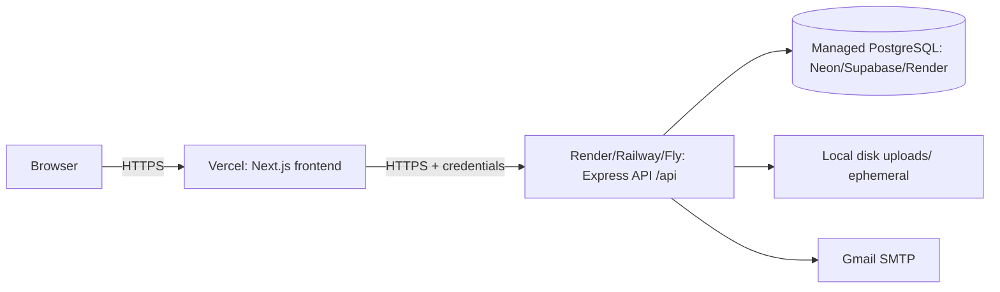

# 24 — Deployment Architecture

Realistic deployment for the assessment. Decisions: ADR-004 (storage/ephemeral), ADR-008 (cross-origin cookies), ADR-019 (seed).

## 1. Topology



| Component | Platform (recommended) | Notes |
|---|---|---|
| Frontend | **Vercel** | Next.js App Router native. |
| Backend | **Render** (or Railway/Fly) | Node web service. |
| Database | **Neon** / Supabase / Render PostgreSQL | managed, free tier. |
| Email | Gmail SMTP (app password) | per provided env. |

## 2. Environments

| Env | Frontend | Backend | DB | Cookie |
|---|---|---|---|---|
| Local | localhost:3000 | localhost:8080 | local/Docker PG | `SameSite=Lax`, non-Secure |
| Production | *.vercel.app | *.onrender.com | managed | `SameSite=None; Secure` |

`COOKIE_SECURE` / `COOKIE_SAMESITE` derived from `NODE_ENV` or explicit env vars (`25`).

## 3. Cross-origin cookie config (critical, ADR-008)

Because frontend and backend are different sites:

- Backend CORS: `origin: [FRONTEND_URL]`, `credentials: true`, allow `Content-Type, X-Requested-With`.
- Cookie: `HttpOnly; Secure; SameSite=None; Path=/`.
- Frontend Axios: `withCredentials: true`, sends `X-Requested-With` (ADR-021).
- Both must be HTTPS (Vercel + Render provide TLS). `SameSite=None` without `Secure` is rejected by browsers.

## 4. Build & start

### Backend

```
Build:  npm install && npx prisma generate && npm run build
Release:npx prisma migrate deploy && npx prisma db seed   # run migrations + admin seed
Start:  node dist/server.js   (npm start)
```

- `prisma migrate deploy` applies committed migrations (no prompts).
- Seed is idempotent (upsert admin) — safe to run each deploy (ADR-019).
- Set the release/pre-start command in the platform (Render "Pre-Deploy Command" or start script chaining).

### Frontend

```
Build: npm install && npm run build
Start: next start   (Vercel manages automatically)
```

Set `NEXT_PUBLIC_API_URL` to the backend origin (no trailing `/api`; client appends it).

## 5. Environment variables (deploy)

See `25` for full table. Production must set:

- Backend: `PORT`, `DATABASE_URL`, `JWT_SECRET`, `ADMIN_*`, `GMAIL_*`, `FRONTEND_URL`, `NODE_ENV=production`, `COOKIE_SECURE=true`, `COOKIE_SAMESITE=none`.
- Frontend: `NEXT_PUBLIC_API_URL`.

## 6. Storage in production (ADR-004 risk)

- Local disk on free dynos is **ephemeral**: uploads are lost on redeploy/restart.
- Documented clearly in README. Upgrade paths (P1): platform persistent disk, or object storage (S3/Cloudflare R2) behind `StorageService`.
- For demo, note this limitation; re-upload after redeploy if needed.

## 7. Database migrations

| Step | Command | When |
|---|---|---|
| Author migration | `prisma migrate dev --name x` | local dev |
| Apply in prod | `prisma migrate deploy` | each release |
| Generate client | `prisma generate` | build |
| Seed admin | `prisma db seed` | after migrate |

Migrations committed to `server/prisma/migrations/`.

## 8. Health & monitoring

- `GET /health` for platform health checks (ADR-026).
- Platform logs for stdout/stderr; structured request logs (P1, `06`).

## 9. Production configuration checklist

- [ ] HTTPS on both apps.
- [ ] CORS origin = exact Vercel URL; `credentials: true`.
- [ ] Cookie `Secure; SameSite=None` in prod.
- [ ] `JWT_SECRET` strong + set in backend only.
- [ ] `DATABASE_URL` points at managed PG with SSL (`?sslmode=require` if needed).
- [ ] `migrate deploy` + `db seed` run on release.
- [ ] `NEXT_PUBLIC_API_URL` set on Vercel.
- [ ] Gmail app password valid (or accept console fallback disabled in prod).
- [ ] uploads directory writable; ephemeral-disk caveat documented.

## 10. Docker (P2)

Optional `Dockerfile` per app + `docker-compose.yml` (api + db) for local parity. Not required for MVP.
