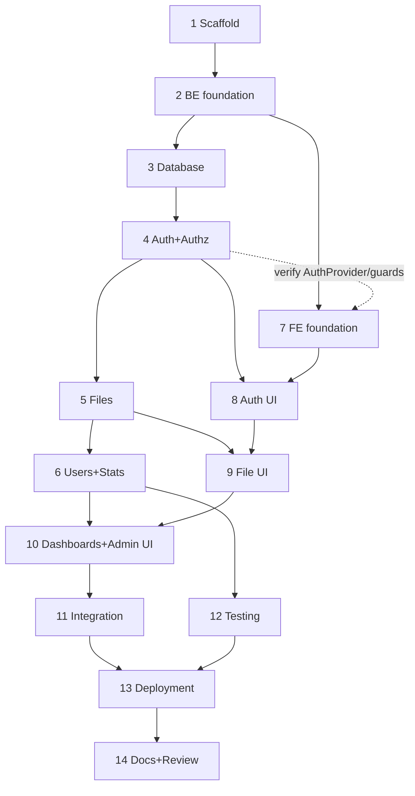

# 27 — Development Phases

Complete implementation roadmap, dependency-ordered and time-boxed for an 8–10 hour build. Each phase lists area, goal, steps (tagged BE/FE/DB/OPS/QA), files, APIs, DB changes, tests, output, and Definition of Done. Tasks referenced by ID from `26`.

## Time allocation (target ~9h core + buffer)

| Phase | Focus | Time |
|---|---|---|
| 1 | Planning & scaffold | 20 min |
| 2 | Backend foundation | 30 min |
| 3 | Database | 25 min |
| 4 | Auth & authorization | 90 min |
| 5 | Files (upload/list/details/delete/extract) | 90 min |
| 6 | Users (admin) & statistics | 45 min |
| 7 | Frontend foundation | 40 min |
| 8 | Auth UI | 50 min |
| 9 | File UI | 70 min |
| 10 | Dashboards & Admin UI | 70 min |
| 11 | Integration | 30 min |
| 12 | Testing (T0) | 45 min |
| 13 | Deployment | 40 min |
| 14 | Docs & final review | 25 min |
| — | Buffer | 40 min |

Total = 670 min core + 40 min buffer = **710 min ≈ 11h50**.

> **Budget note (8–10h target).** The full P0 estimate above (≈11h50) runs over the 8–10h target because it front-loads production-quality error handling, tests, and deployment. To land inside 8–10h of focused work, defer the P1 items and trim as follows (saves ≈2h): drop rate limiting (BE-017) and structured request logging from BE-006 while keeping `/health`; reduce Testing (Phase 12) to the T0 auth + ownership + upload suites only (~25 min); collapse Phase 8/9 polish. This yields ≈9h30 core + buffer ≈ within budget. Bonuses (P2) only if buffer remains.

| Realistic 8–10h profile (P0 essentials) | Time |
|---|---|
| Phases 1–3 (scaffold, foundation, DB) | 70 min |
| Phase 4 Auth+Authz | 80 min |
| Phase 5 Files | 85 min |
| Phase 6 Users+Stats | 40 min |
| Phase 7 FE foundation | 35 min |
| Phase 8 Auth UI | 45 min |
| Phase 9 File UI | 60 min |
| Phase 10 Dashboards+Admin UI | 60 min |
| Phase 11 Integration | 25 min |
| Phase 12 Testing (T0 only) | 25 min |
| Phase 13 Deployment | 35 min |
| Phase 14 Docs+review | 20 min |
| Buffer | 30 min |
| **Total** | **≈ 10h10** |

## Dependency order

---

## Phase 1 — Planning & Scaffold · OPS · 20m · P0

- Goal: runnable skeletons for both apps.
- Steps: [OPS] init dirs + root `.gitignore` (ignore `.env*`, `uploads/`, `node_modules`, `.next`, `dist`); [BE] scaffold Express+TS; [FE] scaffold Next.js+Tailwind; [OPS] `.env.example` both.
- Output: `server` boots, `client` renders, examples committed.
- DoD: both dev servers start; git clean; matches `16`.

## Phase 2 — Backend Foundation · BE · 30m · P0

- Goal: shared infrastructure.
- Steps: [BE] env.ts + constants.ts (Zod fail-fast); [BE] credentialed CORS + body limits; [BE] response/AppError/asyncHandler; [BE] errorHandler+notFound; [BE] validate middleware; [BE,P1] requestLogger + `/health`.
- APIs: `/health`. DB: none. Tests: manual `/health`.
- DoD: unknown route → 404 envelope; `/health` ok; CORS permits FRONTEND_URL with credentials. (BE-001..006)

> **Deviation recorded (Phase 2 execution).** The Prisma client singleton originally listed in BE-002 moved to Phase 3 as **DB-001b**: `@prisma/client` cannot be imported before a schema exists to generate it from, so keeping it here would prevent the server from booting. Everything else in BE-002 stayed. Body limit fixed at **100 KB** for JSON/urlencoded (multipart uploads use Multer limits instead). Request logging is a ~15-line local middleware rather than `morgan`, per the anti-overengineering rule on unnecessary dependencies.

## Phase 3 — Database · DB · 25m · P0

- Goal: schema + admin.
- Steps: [DB] models+enums (`09`); [DB] indexes/constraints/cascade; [DB] initial migration; [DB] idempotent seed.
- DB changes: create tables/enums/indexes. Tests: `migrate dev` clean; seed creates admin.
- DoD: matches `09`/`10`; admin login-ready (verified, ADMIN). (DB-001..004)

## Phase 4 — Auth & Authorization · BE · 90m · P0

- Goal: full auth + RBAC.
- Steps: [BE] PasswordService; [BE] TokenService (cookie flags env-driven); [BE] OtpService; [BE] MailService(+fallback); [BE] authenticate; [BE] authorizeRole; [BE] auth module endpoints (register/verify/resend/login/logout/profile); [BE,P1] rate limit.
- APIs: all `/auth/*`. DB: User, VerificationCode writes. Tests: T0 auth suite.
- DoD: `12` flow works end-to-end; cookie set; protected route 401 without cookie; matches `11`. (BE-010..017)

## Phase 5 — Files · BE · 90m · P0

- Goal: upload pipeline + CRUD.
- Steps: [BE] StorageService; [BE] upload middleware (limits+fileFilter); [BE] ExtractionService; [BE] upload endpoint (validate+magic bytes+store+extract+persist, partial success); [BE] list own + search/filter/sort/paginate; [BE] details+ownership; [BE] delete row+blob; [BE,P1] download stream; [BE] admin scope=all.
- APIs: `/files/*`. DB: File writes/reads. Tests: T0 upload + ownership.
- DoD: `13` pipeline; cross-owner 403; matches `11`. (BE-020..028)

## Phase 6 — Users (Admin) & Statistics · BE · 45m · P0

- Goal: admin user mgmt + stats.
- Steps: [BE] users list/search/paginate; [BE] patch role + self-demote guard; [BE] delete user cascade + blob cleanup + self-delete guard; [BE] stats/user; [BE] stats/admin.
- APIs: `/users/*`, `/stats/*`. DB: reads/aggregations, cascade deletes. Tests: admin self-protection, stats totals.
- DoD: matches `21`/`22`; self delete/demote → 403. (BE-030..041)

## Phase 7 — Frontend Foundation · FE · 40m · P0

- Goal: client infrastructure.
- Steps: [FE] Axios instance (withCredentials, header, 401 redirect); [FE] QueryClient + providers; [FE] UI primitives; [FE] AuthProvider + protected/admin guards; [FE] services+hooks scaffold.
- DoD: guards redirect correctly; queries hit API with credentials. (FE-001..005)

## Phase 8 — Auth UI · FE · 50m · P0

- Goal: auth screens.
- Steps: [FE] register; [FE] verify-email + resend; [FE] login; [FE] profile + logout. Each with loading/error/toast.
- APIs consumed: `/auth/*`. DoD: register→verify→login→profile→logout all work; `04` flows. (FE-010..013)

## Phase 9 — File UI · FE · 70m · P0

- Goal: file management screens.
- Steps: [FE] Dropzone + multi + client validation; [FE] upload mutation + progress + toasts + invalidation; [FE] My Files list (search/filter/sort/paginate, empty/loading); [FE] details + extracted content; [FE,P1] preview; [FE] delete + confirm.
- APIs: `/files/*`. DoD: `13`/`04` upload+browse+details+delete work. (FE-020..025)

## Phase 10 — Dashboards & Admin UI · FE · 70m · P0

- Goal: stats + admin surface.
- Steps: [FE] user dashboard (Recharts); [FE] admin dashboard (Recharts + recent); [FE] admin users table + role/delete (confirm); [FE] admin files table (all) + search/filter/paginate + delete.
- APIs: `/stats/*`, `/users/*`, `/files?scope=all`. DoD: charts render; admin-only; confirmations present. (FE-030..033)

## Phase 11 — Integration · Both · 30m · P0

- Goal: end-to-end coherence.
- Steps: [QA/FE] manual pass of every P0 flow; fix envelope/CORS/cookie mismatches; verify invalidations.
- DoD: all P0 user+admin journeys succeed locally. (FE-040)

## Phase 12 — Testing · QA · 45m · P0

- Goal: automated confidence.
- Steps: [QA] T0 suites (auth, rbac, ownership, upload validation, admin self-protection); [QA,T1] query/stats/extraction.
- DoD: T0 green; commands documented (`23`). (QA-001/002)

## Phase 13 — Deployment · OPS · 40m · P0

- Goal: live app.
- Steps: [OPS] managed PostgreSQL; [OPS] deploy backend + `migrate deploy` + `db seed` + env (cookie None/Secure, CORS origin); [OPS] deploy frontend (Vercel) + `NEXT_PUBLIC_API_URL`; verify cross-origin auth.
- DoD: `24` checklist passes; production login+upload work. (OPS-010..012)

## Phase 14 — Docs & Final Review · OPS/QA · 25m · P0

- Goal: submission-ready.
- Steps: [OPS] update root README (live URLs, setup, assumptions link) per `34`; [QA] run `35` checklist + quality review (`QUALITY REVIEW`).
- DoD: README complete; `35` all P0 done; repo clean, no secrets.

## Out-of-scope during phases (P3)

Advanced OCR, folder hierarchies, sharing/collaboration, real-time editing, microservices, event-driven infra, audit systems, Docker (P2), refresh tokens (P2). Do not build unless all P0 done and buffer remains.
