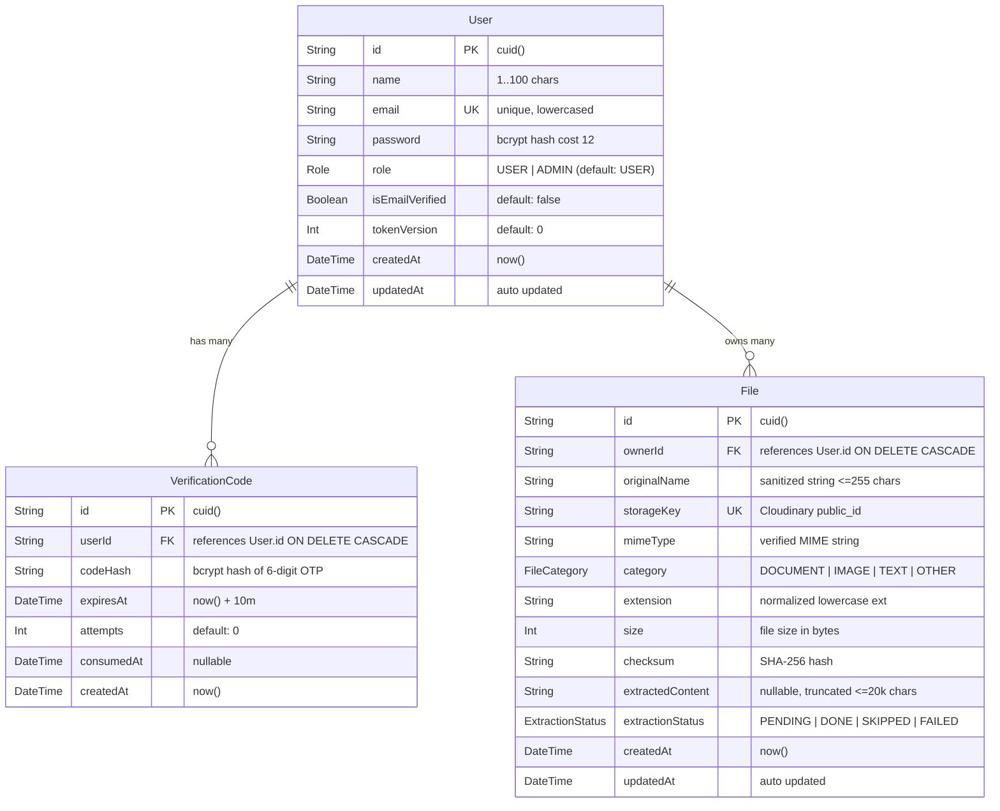
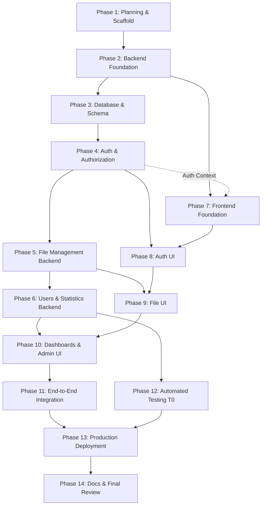
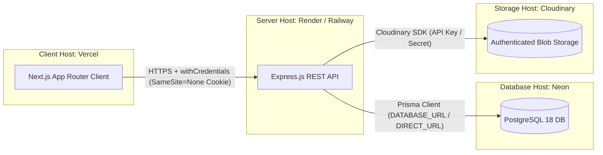

# PROJECT CONTEXT — Filox (Managing Your Files)

**Status:** Approved Single Source of Truth  
**Product Name:** Filox (ADR-035)  
**Assessment Title:** Managing Your Files — Full Stack Developer Assessment  
**Author:** Mohand Hatem  
**Repository:** `client/` (Next.js) + `server/` (Express) + `docs/`  

---

## 1. Project Identity

* **Project Name:** Filox
* **Project Type:** Full-Stack Web Application (Modular Monolith: Next.js frontend + Express.js backend + PostgreSQL database)
* **Project Purpose:** A secure, modern file management platform enabling authenticated users to upload, validate, organize, search, preview, and inspect metadata/extracted content of their personal files, alongside comprehensive personal usage statistics. For system operators, it provides a dedicated administration interface to manage all users, oversee all uploaded files, enforce governance/moderation, and monitor system-wide storage and ingestion statistics.
* **Assessment Context:** Developed as a technical hiring assessment for a Senior/Lead Full Stack Developer. Designed for approximately **8–10 hours of focused implementation effort** within a 10-day evaluation window.
* **Expected Deliverables:**
  1. Public GitHub repository containing complete source code (`client/`, `server/`, `docs/`) with clean, conventional git commit history.
  2. Publicly hosted, fully operational Frontend web application (Vercel).
  3. Publicly hosted, fully operational Backend REST API with connected managed PostgreSQL database (Render / Railway + Neon PostgreSQL).
  4. Comprehensive root `README.md` documenting architecture, features, prerequisites, local setup instructions, environment variables, database migrations, API documentation, assumptions, and live production URLs.

---

## 2. Business Overview

* **Problem Statement:** Individuals and teams frequently require a lightweight, dependable tool to store documents and images, inspect their contents, search through metadata/extracted text, and understand their storage footprint without the bloat, complexity, or cognitive overhead of enterprise cloud storage drives. System operators simultaneously require clean administrative oversight to audit user accounts, reclaim storage, and remove prohibited content.
* **Solution:** Filox delivers an end-to-end, high-performance, secure file management lifecycle with verified authentication (email OTP), robust validation (extension, MIME, magic bytes), background-safe text extraction, ownership isolation, personal analytics, and administrative management.
* **Target Users & Personas:**
  * **Guest / Visitor:** Unauthenticated actor exploring the landing page, registering for a new account, verifying email via 6-digit OTP, or logging in.
  * **Registered User (`role: USER`):** Verified account owner who uploads single or multiple files (with drag & drop and real-time progress), searches/filters/sorts/paginates their file library, views metadata and extracted text, deletes their own files, and views personal storage statistics.
  * **Administrator (`role: ADMIN`):** System operator with full supervisory privileges who manages all registered users (search, role update, cascade deletion), manages all uploaded files across all users, inspects system statistics, and reviews recent system uploads.
* **Business Lifecycle Overview:**
  1. *Registration & Verification Lifecycle:* Register → OTP generated & hashed in DB → Dispatched via email → User submits OTP → Account marked verified → Login enabled.
  2. *File Ingestion & Management Lifecycle:* Client selects files (drag & drop / picker) → Client advisory validation → Multipart HTTP upload → Server authoritative validation (size, count, extension, declared MIME, magic bytes) → Cloudinary authenticated storage upload → Text extraction (txt, md, csv, json, pdf, docx) → Database metadata persistence → Listed in "My Files" → Search / Filter / Sort / Paginate → Inspect Details & Extracted Content → Authenticated Download/Preview → Delete (row + blob removal).
  3. *Administration & Governance Lifecycle:* Admin login → Role verified via server-side RBAC → Admin dashboard access → Search & manage users → Promote/demote roles (self-protection enforced) → Delete abusive users (cascading all files and blobs) → Search & delete any system file → Inspect system-wide metrics.

---

## 3. Company Requirements

All mandatory requirements from the original company hiring assessment are preserved in full without loss or reinterpretation:

### 3.1 Authentication & Authorization
* User Registration (Name, Email, Password) with uniqueness constraint.
* Email Verification using One-Time Password (OTP).
* Resend Verification Code mechanism.
* User Login (gated on verified email).
* JWT Authentication with secure session transport.
* Protected Routes across Frontend and Backend.
* Role-based Authorization (`USER` and `ADMIN`).
* User Profile view (`/auth/profile`).

### 3.2 User Capabilities & File Management
* Single and Multiple file uploads in a single request.
* Drag and drop file upload interface.
* Upload progress indicator.
* Client-side and server-side file validation.
* My Files view listing uploaded files.
* Search files by keyword.
* Filter files by category/type.
* Sort files by date, size, name.
* Pagination for file listings.
* View file details: Original name, File type, MIME type, File size, Upload date, Extracted content.
* Delete own files (removes record and physical storage).
* User Statistics: Total uploaded files, Storage usage, File type distribution, Upload history.

### 3.3 Admin Capabilities
* Dedicated Admin Dashboard.
* User Management: List all users, search users, edit user roles, delete users.
* File Management: View all files across all users, search/filter/paginate all files, delete any file.
* Admin Statistics: Total users, Total files, Total storage usage, Most uploaded file types, Recent uploads.
* Admin route protection enforced on both Frontend (UX) and Backend (Authoritative Security).

### 3.4 Technical & Architecture Requirements
* Frontend: Next.js (App Router), TypeScript, Tailwind CSS, Framer Motion, TanStack React Query, Axios.
* Backend: Node.js, Express.js, TypeScript, Prisma ORM, PostgreSQL, JWT Authentication, Multer.
* Clean Architecture principles with Modular Monolith structure.
* Consistent API response envelopes and centralized error handling.
* Complete database modeling with referential integrity and cascading deletes.

---

## 4. Required Technology Stack

### 4.1 Required Technologies (Fixed by Company)
* **Frontend:** Next.js (App Router `client/app`), TypeScript, Tailwind CSS, Framer Motion, TanStack React Query (`@tanstack/react-query`), Axios (`axios`).
* **Backend:** Node.js (v20+), Express.js (`express@5`), TypeScript (`typescript@5.9`), Prisma ORM (`@prisma/client@6.19.3`, `prisma@6.19.3`), PostgreSQL (Neon PostgreSQL 18), JWT (`jsonwebtoken`), Multer (`multer@2.3.0`).

### 4.2 Approved Additional Technologies (Documented in ADRs)
* **Validation:** Zod (`zod`) for schema validation across backend request bodies/queries and frontend forms (ADR-017).
* **Password Hashing:** `bcrypt` (cost factor 12) for secure credential hashing (ADR-018).
* **Email Delivery:** `nodemailer` for SMTP email dispatch with console fallback for local development (ADR-011).
* **Data Visualization / Charts:** `recharts` for declarative, responsive user and admin dashboard analytics (ADR-014 — Reviewer Locked).
* **Magic-Byte Sniffing:** `file-type@16.5.4` (CommonJS pin) to prevent MIME spoofing (ADR-003, ADR-040).
* **Content Extraction:** `pdf-parse@1.1.4` (PDF text extraction) and `mammoth@1.12.2` (DOCX extraction) (ADR-005, ADR-040).
* **Blob Storage:** Cloudinary (`cloudinary@2.11.0`) with authenticated access via `StorageService` to survive ephemeral deployments (ADR-039).
* **Automated Testing:** Vitest (`vitest`) + Supertest (`supertest`) for backend integration tests (ADR-001/Docs 23).
* **Backend Execution:** `tsx` for TypeScript execution in development.

### 4.3 Optional / Deferred Technologies (P2/P3)
* `express-rate-limit` (P1 auth rate-limiting middleware).
* Docker / Docker Compose (P2 containerization).
* Soft-delete extensions (P2).
* Redis / BullMQ / Microservices (P3 — Strictly Out of Scope).

---

## 5. Product Scope

### Priority Classification

| Priority | Definition | Scope Rules |
|---|---|---|
| **P0** | **Mandatory / MVP** | Explicitly required by the company brief. Must be 100% complete, fully verified, and deployed. |
| **P1** | **Important / Quality & Hardening** | Streaming preview/download, rate limiting, health check, CSRF hardening, token versioning, audit logging. Built only if P0 remains uncompromised. |
| **P2** | **Bonus / Nice to have** | Dark mode, folder hierarchy, soft delete, refresh tokens, Docker, deduplication UI, password change. Built only if time buffer permits. |
| **P3** | **Out of Scope** | Advanced OCR, real-time collaboration, microservices, message queues, event buses, distributed caching. Strictly prohibited. |

---

## 6. User Capabilities

Authenticated regular users (`role = USER`) can:
1. **Manage Identity:** View own profile details (`name`, `email`, `role`, `isEmailVerified`, `createdAt`), initiate password reset or verification flows, log out cleanly.
2. **Upload Files:** Upload up to 5 files (max 10 MB per file, max 50 MB per batch) with drag-and-drop, client-side pre-validation, real-time upload progress, and immediate feedback on partial batch successes/failures.
3. **Manage Personal Library:** Access "My Files" to list their own uploaded files with server-side pagination (default 10, max 100).
4. **Search & Discovery:** Search own files by keyword (matching filename and extracted text), filter by category (`DOCUMENT`, `IMAGE`, `TEXT`, `OTHER`), and sort by `createdAt`, `size`, or `originalName` (asc/desc).
5. **Inspect File Details:** Open individual file details to inspect full metadata (original name, size, MIME type, category, SHA-256 checksum, upload timestamp) and preview extracted text content (capped at 20,000 characters).
6. **Secure Download/Preview:** Stream authentic file contents via authenticated endpoints (P1).
7. **Delete Files:** Delete personal files with confirmation, permanently removing the database record and the remote storage blob.
8. **View Personal Analytics:** Access the personal dashboard displaying total file count, total storage consumed (formatted in KB/MB/GB), file category distribution chart (Pie/Donut), and 30-day upload history chart (Line/Area).

---

## 7. Admin Capabilities

System administrators (`role = ADMIN`) possess all User capabilities plus:
1. **Admin Dashboard:** Access dedicated administrative dashboard featuring high-level system metrics (Total Users, Total Files, Total Storage Usage), top uploaded file types breakdown (Bar chart), and recent uploads across the entire system.
2. **User Management:**
   * View paginated list of all registered users with search (name/email) and sorting.
   * Update user roles (`USER` ↔ `ADMIN`).
   * Delete users with confirmation, automatically cascading the deletion of their database records, verification codes, file records, and physical storage blobs.
   * **Self-Protection Guard:** Strict backend block preventing an admin from deleting or demoting their own account (`ERR_SELF_DELETE`, `ERR_SELF_DEMOTE`).
3. **System-wide File Management:**
   * View paginated list of all uploaded files across all users with owner attribution (`owner: { id, name, email }`).
   * Search, filter, sort, and inspect any file in the system.
   * Delete any file from the system with confirmation, purging database rows and remote storage blobs.

---

## 8. Authentication & Authorization

* **Architecture:** Email & password authentication with mandatory email verification via 6-digit OTP and JWT session transport via `httpOnly` cookies (ADR-007, ADR-008).
* **Password Security:** Salted and hashed using `bcrypt` at cost factor 12 (ADR-018). Plaintext passwords are never stored, logged, or returned.
* **OTP Policy:**
  * 6-digit cryptographically random numeric code.
  * Stored bcrypt-hashed in `VerificationCode.codeHash`.
  * Time-To-Live (TTL): 10 minutes.
  * Rate Limits: Max 5 verification attempts per code; 60-second resend cooldown; max 5 resend requests per hour (ADR-010).
  * Issuing a new code consumes/invalidates prior active codes (ADR-038).
* **JWT Strategy:**
  * Algorithm: HS256 signed with `JWT_SECRET` (enforced ≥32 characters at boot, ADR-031).
  * Expiration: 7 days.
  * Payload: `{ sub: userId, role: USER|ADMIN, tokenVersion: number, iat, exp }`.
  * Transport: Stored in an `httpOnly`, `Secure`, `SameSite=None` cookie named `access_token` for production cross-site compatibility (Vercel ↔ Render), with `SameSite=Lax` for local HTTP development (ADR-008).
  * Fallback: `Authorization: Bearer <token>` accepted for programmatic/test access.
* **Logout:** `POST /api/auth/logout` is public and idempotent, clearing the `access_token` cookie and resetting client state (ADR-036).
* **Authorization Boundaries:**
  * Frontend route guards (Next.js layout/middleware) provide UX guidance only (redirects and conditional UI).
  * Backend middleware (`authenticate`, `authorizeRole('ADMIN')`) and service-level ownership checks (`file.ownerId === req.user.id`) form the **sole authoritative security boundary**.

---

## 9. File Management Pipeline

```mermaid
flowchart TD
  A[Client: Drag & Drop / File Picker] --> B[Client Validation: Extension, Size <=10MB, Count <=5]
  B -->|Invalid| B1[Reject in UI with Toast]
  B -->|Valid| C[Axios Multipart POST /api/files/upload with onUploadProgress]
  C --> D[Express Route + Rate Limiter]
  D --> E[Multer MemoryStorage with Limits]
  E --> F[Authoritative Server Validation: Ext + Declared MIME + Magic Bytes]
  F -->|Invalid| F1[Record in failed[] array; continue batch]
  F -->|Valid| G[StorageService: Upload Buffer to Cloudinary Authenticated]
  G --> H[Compute SHA-256 Checksum]
  H --> I[Derive Category: DOCUMENT | IMAGE | TEXT | OTHER]
  I --> J[ExtractionService: UTF-8 / pdf-parse / mammoth]
  J --> K[Prisma: Persist File record with status DONE/FAILED/SKIPPED]
  K -->|DB Error| K1[Rollback: Remove Cloudinary Blob + Record in failed[]]
  K --> L[Respond 201: { uploaded[], failed[] }]
  L --> M[React Query: Invalidate ['files'] and ['stats', 'user']]
```

### Ingestion Specifications:
* **Limits:** Max 10 MB per file, max 5 files per request, max 50 MB total request payload (ADR-002).
* **Allowed Types:** `txt`, `md`, `csv`, `json`, `pdf`, `docx`, `png`, `jpg`, `jpeg`, `webp` (ADR-003).
* **Validation Enforcement:** Extension allowlist + declared Content-Type + `file-type` magic-byte buffer inspection must strictly agree. Zero-byte files rejected (ADR-042).
* **Content Extraction:** Text decoded for UTF-8 documents; `pdf-parse` for PDFs; `mammoth` for DOCX files. Truncated to 20,000 characters. Images skipped. Extraction failure is non-blocking (`extractionStatus = FAILED`) to ensure upload durability (ADR-005, ADR-006).
* **Storage Isolation:** Uploads stored under opaque UUID keys (`crypto.randomUUID()`, ADR-041). Cloudinary storage set to `type: "authenticated"`. Raw storage URLs are never exposed.

---

## 10. Statistics & Analytics Engine

All statistics queries are computed server-side directly from indexed relational database tables (`File`, `User`):

### 10.1 User Statistics (`GET /api/stats/user`)
* **Scope:** Scoped strictly to `ownerId = req.user.id`.
* **Metrics:**
  1. `totalFiles`: Total count of files owned by user (`COUNT(*)`).
  2. `storageUsedBytes`: Total bytes consumed (`SUM(size)`).
  3. `typeDistribution`: File count grouped by category (`category: DOCUMENT|IMAGE|TEXT|OTHER`, `count`).
  4. `uploadHistory`: File counts grouped by day for the trailing 30 days (`{ date: "YYYY-MM-DD", count }` ascending).

### 10.2 Admin Statistics (`GET /api/stats/admin`)
* **Scope:** Global system-wide aggregation (Admin only).
* **Metrics:**
  1. `totalUsers`: Total registered user count (`COUNT(User)`).
  2. `totalFiles`: Total system file count (`COUNT(File)`).
  3. `storageUsedBytes`: Total aggregate storage consumed across all users (`SUM(File.size)`).
  4. `topFileTypes`: System-wide file category distribution sorted descending.
  5. `recentUploads`: Latest 10 uploaded files across the system with attached owner details (`{ id, originalName, size, createdAt, owner: { id, name } }`).

---

## 11. Database Design & Relational Model

The database is designed with PostgreSQL 16/18 using Prisma ORM with strict referential integrity and cascading relationships:



### Essential Database Indexes
* `User(email)` [Unique] — Fast lookup during authentication.
* `File(ownerId)` — Accelerated user file listing (hot query path).
* `File(ownerId, createdAt)` — Efficient default sorting for user files.
* `File(ownerId, category)` — Fast filtered user file queries.
* `File(createdAt)` — Rapid aggregation of admin recent uploads.
* `File(storageKey)` [Unique] — Ensures blob key integrity.
* `VerificationCode(userId, createdAt)` — Efficient rate limiting and active code resolution.

---

## 12. REST API Specification

Mounted under the `/api` prefix (ADR-027), with `/health` mounted at the root.

### Standard Response Envelope (ADR-025)
* **Success Response:**
  ```json
  {
    "success": true,
    "data": { ... },
    "meta": { "page": 1, "limit": 10, "total": 42, "totalPages": 5 }
  }
  ```
* **Error Response:**
  ```json
  {
    "success": false,
    "error": {
      "code": "ERR_VALIDATION",
      "message": "Invalid input provided.",
      "details": [{ "field": "email", "message": "Email already exists." }]
    }
  }
  ```

### Comprehensive Endpoints Registry

| Method | Endpoint | Access Level | Description |
|---|---|---|---|
| `GET` | `/health` | Public | System liveness probe (`status: "ok"`, uptime, timestamp). |
| `POST` | `/api/auth/register` | Public | Register new user account; dispatches OTP email. |
| `POST` | `/api/auth/verify-email` | Public | Submits 6-digit OTP; verifies and activates user account. |
| `POST` | `/api/auth/resend-code` | Public | Resends new OTP (enforces 60s cooldown & 5/hr cap). |
| `POST` | `/api/auth/login` | Public | Authenticates credentials; sets `access_token` httpOnly cookie. |
| `POST` | `/api/auth/logout` | Public | Clears `access_token` cookie; resets session state (idempotent). |
| `GET` | `/api/auth/profile` | User | Retrieves authenticated user profile details. |
| `GET` | `/api/users` | Admin | Lists all users with search, pagination, and sorting. |
| `PATCH` | `/api/users/:id` | Admin | Updates user role (`USER` ↔ `ADMIN`); self-demote blocked. |
| `DELETE` | `/api/users/:id` | Admin | Deletes user with cascade; self-delete blocked. |
| `POST` | `/api/files/upload` | User | Multipart upload (1–5 files, ≤10MB/file); validates, stores, extracts. |
| `GET` | `/api/files` | User / Admin | Lists files (user: own files; admin with `?scope=all`: all files with owner). |
| `GET` | `/api/files/:id` | Owner / Admin | Retrieves single file metadata and extracted content. |
| `GET` | `/api/files/:id/download` | Owner / Admin | Authenticated streaming download/preview with Content-Disposition. |
| `DELETE` | `/api/files/:id` | Owner / Admin | Deletes file record and removes Cloudinary blob. |
| `GET` | `/api/stats/user` | User | Returns personal file count, storage used, type distribution, 30d history. |
| `GET` | `/api/stats/admin` | Admin | Returns system total users, files, storage, top types, recent uploads. |

---

## 13. Frontend Architecture

* **Framework & Routing:** Next.js 16+ App Router (`client/app`) structured using route groups:
  * `(public)`: Public marketing landing page, `/login`, `/register`, `/verify-email`.
  * `(protected)`: Authenticated layout with navigation and sidebar, `/dashboard`, `/files`, `/files/[id]`, `/profile`.
  * `(admin)`: Sub-layout strictly enforcing Admin role, `/admin`, `/admin/users`, `/admin/files`.
* **State Management & Data Fetching:**
  * Server state handled exclusively via TanStack React Query (`@tanstack/react-query`) with explicit query keys (`['files']`, `['file', id]`, `['stats', 'user']`, `['admin', 'users']`, `['admin', 'stats']`).
  * UI state handled with React `useState` / `useReducer`.
  * URL query params synced for filter, search, sort, and pagination state.
  * Auth state managed via `AuthProvider` React Context wrapping the root application.
* **Component Architecture:**
  * `components/ui/`: Reusable, accessible UI primitives (Button, Input, Table, Dialog/Modal, Toast, Skeleton, EmptyState, Pagination, ProgressBar).
  * `features/`: Domain-specific composite components (`features/auth`, `features/files`, `features/dashboard`, `features/admin`).
* **Design & Motion:** Tailwind CSS v4 CSS-first design tokens with Framer Motion transitions for smooth page transitions, modal entrances, and progress feedback.

---

## 14. Backend Architecture

* **Pattern:** Layered Modular Monolith with clear vertical separation of concerns:
  ```text
  HTTP Request
      ↓
  Route Definition (Express Router)
      ↓
  Validation Middleware (Zod schema parser)
      ↓
  Auth / RBAC Middleware (JWT cookie validation, Role check)
      ↓
  Controller Layer (HTTP handling, status codes, response envelope)
      ↓
  Service Layer (Business logic, orchestration, validation, error throwing)
      ↓
  Repository Layer (Prisma Client queries, direct data access)
      ↓
  PostgreSQL Database / External Services (Cloudinary, Nodemailer)
  ```
* **Error Handling Infrastructure:**
  * Custom `AppError` class encapsulating machine-readable error codes (`ERR_*`), HTTP status codes, and user-safe messages.
  * Controller handlers wrapped with `asyncHandler` to eliminate try-catch boilerplate.
  * Centralized `errorHandler` middleware transforming domain errors, Prisma errors, and Multer errors into the unified JSON envelope.

---

## 15. File Storage Architecture

* **Storage Provider:** Cloudinary (`cloudinary@2.11.0`) operated via the `StorageService` abstraction (ADR-039).
* **Storage Key Structure:** `<CLOUDINARY_FOLDER>/<UUID>.<extension>` (e.g., `filox/9b1deb4d-3b7d-4bad-9bdd-2b0d7b3dcb6d.pdf`).
* **Access Control:** Blobs uploaded with `type: "authenticated"`. Raw Cloudinary URLs are never returned in client API responses. All file downloads and previews pass through `/api/files/:id/download`, ensuring full authentication and ownership enforcement before streaming.
* **Storage Durability & Reliability:** Files survive server redeployments and dyno restarts. In the event of a database write failure after a successful Cloudinary upload, the orphaned blob is immediately cleaned up.

---

## 16. Email & OTP Delivery

* **Transporter:** `nodemailer` configured for Gmail SMTP using an App Password (`GMAIL_USER`, `GMAIL_PASS`).
* **Development Fallback:** In local environments without SMTP credentials, `MailService` automatically logs the generated 6-digit OTP directly to the developer console, guaranteeing that testing and evaluation flows remain completely unblocked.
* **Brute-Force & Abuse Protections:** OTP hashed with bcrypt; maximum 5 verification attempts before invalidation; 60-second cooldown between resend requests; maximum 5 resend requests per hour.

---

## 17. Security Architecture & Threat Matrix

| Category | Security Control / Threat Defense | Priority | Reference |
|---|---|---|---|
| **Credentials** | Passwords hashed with `bcrypt` (cost factor 12). Plaintext never stored or returned. | P0 | ADR-018 |
| **Session Transport** | JWT signed with HS256 (≥32 char secret) transmitted via `httpOnly`, `Secure`, `SameSite=None` cookie. | P0 | ADR-008, ADR-031 |
| **CORS Policy** | Credentialed CORS restricted strictly to approved origin (`FRONTEND_URL`). Wildcards strictly prohibited. | P0 | ADR-008, Doc 20 |
| **Authorization** | Server-side RBAC and file ownership validation (`ownerId === req.user.id`). Frontend guards are UX only. | P0 | Doc 08, Doc 20 |
| **Admin Self-Protection**| Backend prevents administrators from deleting or demoting their own accounts. | P0 | ADR-020 |
| **Upload Security** | Tripartite validation: extension allowlist + declared MIME + `file-type` magic-byte buffer sniffing. | P0 | ADR-003, Doc 13 |
| **Path Traversal** | Files stored under randomly generated UUIDs. Client filenames sanitised and kept display-only. | P0 | ADR-016, ADR-041 |
| **Injection Defense** | All database queries executed through parameterized Prisma Client queries. Sort fields strictly whitelisted. | P0 | ADR-024, Doc 20 |
| **Payload Limits** | JSON bodies capped at 100 KB; file uploads capped at 10 MB/file, 5 files, 50 MB total. | P0 | ADR-002, ADR-028 |
| **Information Leakage**| Generic authentication error messages; database/stack trace errors suppressed from API responses. | P0 | Doc 19, Doc 20 |
| **Rate Limiting** | Auth endpoints rate-limited to 20 requests per 15-minute window per IP. | P1 | ADR-037 |

---

## 18. Business Rules

1. **Email Uniqueness:** Every user account must possess a unique, case-insensitive email address.
2. **Mandatory Verification:** Users cannot log in until their email has been verified via OTP (`isEmailVerified = true`).
3. **One Active OTP:** Only the most recently generated, unexpired, and unconsumed OTP is valid for an account.
4. **Ownership Boundary:** A regular user can only access, view, download, or delete files where `file.ownerId === user.id`.
5. **Admin Omnipotence:** An administrator can view, search, filter, paginate, and delete any file across the entire system.
6. **Admin Protection:** No administrator may demote their own role or delete their own user account.
7. **Upload Atomicity & Durability:** Failed file extractions must never cause the file upload to fail. Failed database records must clean up associated uploaded blobs.
8. **Cascade Deletion:** Deleting a user account cascades to delete all associated verification codes, file records, and physical storage blobs.

---

## 19. Assumptions

All working assumptions made to resolve ambiguities in the original company brief are formally logged:
* **Storage Limits:** 10 MB per file, 5 files per batch, 50 MB total request payload (ADR-002).
* **Allowed Extensions:** `txt, md, csv, json, pdf, docx, png, jpg, jpeg, webp` (ADR-003).
* **Text Extraction Scope:** Raw UTF-8 text for plain text/JSON; `pdf-parse` for PDFs; `mammoth` for DOCX. Image OCR is strictly excluded as P3 (ADR-005).
* **Extraction Length Cap:** Extracted content truncated to 20,000 characters to protect database performance (ADR-005).
* **Pagination Standards:** Offset pagination with `page` (default 1) and `limit` (default 10, max 100) (ADR-012).
* **Hard Deletion:** File deletion immediately purges database records and Cloudinary blobs (ADR-013).
* **API Prefix:** All API endpoints are organized under the `/api` base path (ADR-027).
* **Token Lifetime:** Single 7-day JWT access token without refresh token rotation for MVP simplicity (ADR-007, ADR-022).

---

## 20. Approved Architectural Decisions (ADRs Log)

| ADR ID | Decision Title | Approved Choice | Rationale |
|---|---|---|---|
| **ADR-001** | Database Engine | PostgreSQL 16/18 | First-class Prisma support, rich indexing, Neon managed service compatibility. |
| **ADR-002** | File Size & Batch Limits | 10 MB/file, 5 files/batch | Balances realistic file handling with platform payload constraints. |
| **ADR-003** | Allowed File Types | 10 extensions + MIME + Magic Bytes | Strict allowlist covering documents and images while blocking executables. |
| **ADR-007** | JWT Strategy | HS256, 7-day expiry | Stateless, production-reliable, matches assessment time budget. |
| **ADR-008** | Token Transport | httpOnly Secure SameSite=None Cookie | Immune to XSS token theft; locked by reviewer for security. |
| **ADR-010** | OTP Policy | 6 digits, 10 min TTL, 5 attempts, cooldown | Standard, user-friendly, brute-force resistant. |
| **ADR-011** | Email Delivery | Nodemailer with Console Fallback | Enables real email delivery with zero local development blocker. |
| **ADR-014** | Charting Library | Recharts | React-native declarative charts; locked by reviewer. |
| **ADR-018** | Password Hashing | bcrypt (cost 12) | Industry standard, computationally secure. |
| **ADR-019** | Admin Bootstrap | Idempotent Prisma Seed Script | Guarantees verified admin account in any environment. |
| **ADR-020** | Admin Self-Protection | Backend Self-Delete & Self-Demote Guard | Prevents accidental admin lockout. |
| **ADR-025** | API Envelope | Unified `{ success, data/error, meta }` | Consistent contract simplifies client fetching and error handling. |
| **ADR-027** | API Base Path | `/api` prefix | Clean separation between API routes and static/infra routes. |
| **ADR-032** | Database Direct URL | `DATABASE_URL` (pooled) & `DIRECT_URL` | Prevents migration failures with PgBouncer transaction pooling. |
| **ADR-033** | Database Host | Neon Managed PostgreSQL | Identical dev/prod database setup; zero local setup overhead. |
| **ADR-034** | Prisma Version Pin | `prisma@6.19.3` | Stable production release avoiding unstable v8 RCs and v7 breaking paths. |
| **ADR-035** | Product Name | **Filox** | Professional, concise product identity. |
| **ADR-036** | Logout Idempotency | Public and idempotent | Allows expired cookie sessions to clear cleanly without 401 traps. |
| **ADR-039** | Storage Provider | Cloudinary via `StorageService` | Solves ephemeral disk data loss on hosted platforms. |
| **ADR-040** | Module System | CommonJS Backend (Pinned CJS Majors) | Avoids fragile ESM refactoring under tight time budget. |
| **ADR-041** | UUID Generation | Native `crypto.randomUUID()` | Drops redundant external `uuid` dependency. |
| **ADR-042** | Zero-Byte Uploads | Rejected with validation error | Empty files provide zero extractable utility. |

---

## 21. Anti-Overengineering Rules

This project enforces strict development discipline to ensure delivery within the 8–10 hour assessment budget:
1. **No Microservices:** Maintain a clean, single-repository modular monolith.
2. **No Message Queues or Workers:** File validation, Cloudinary upload, and text extraction run sequentially in-process.
3. **No Redux / Global Store Bloat:** Rely entirely on TanStack React Query for server cache, React Context for Auth, and URL/local state for UI.
4. **No CQRS or Event Sourcing:** Direct, parameterized Prisma queries in repositories.
5. **No Premature Caching:** In-memory calculations and indexed SQL queries suffice for assessment volumes.
6. **No Hypothetical Abstractions:** Avoid generic factories, wrappers, or managers when direct, readable code solves the requirement.

---

## 22. Development Phases Overview

The project is structured into **14 sequential development phases** encompassing **58 P0 tasks**:



### Phase Summaries:

| Phase | Area | Goal | Dependencies | Key Steps | Expected Output |
|---|---|---|---|---|---|
| **Phase 1** | OPS / Scaffold | Establish runnable client & server skeletons | None | Monorepo structure, Express + TS setup, Next.js + Tailwind scaffold, gitignore, env examples. | `server` boots, `client` renders dev page. |
| **Phase 2** | Backend | Core backend infrastructure & error handling | Phase 1 | `env.ts`, `cors.ts`, response envelope, `errorHandler`, `validate` middleware, `/health`. | Unknown routes return 404 envelope; CORS & health work. |
| **Phase 3** | Database | Relational schema, migrations, admin seed | Phase 2 | `schema.prisma` (User, VerificationCode, File), Prisma client singleton, migrations, admin seed. | Migration clean; admin seeded & verified in DB. |
| **Phase 4** | Backend | Complete authentication & RBAC engine | Phase 3 | PasswordService, TokenService, OtpService, MailService, `authenticate`, `authorizeRole`, auth endpoints. | Full register → OTP → login → profile flow working. |
| **Phase 5** | Backend | File upload pipeline, CRUD & extraction | Phase 4 | StorageService (Cloudinary), upload middleware, ExtractionService, upload/list/details/delete endpoints. | Multipart upload validates, stores, extracts, persists. |
| **Phase 6** | Backend | Admin user management & statistics APIs | Phase 5 | User management endpoints (list, role patch, delete cascade), user & admin stats aggregations. | Self-protection 403s working; stats return per Doc 21. |
| **Phase 7** | Frontend | Client infrastructure, providers & guards | Phase 2, 4 | Axios client (withCredentials), QueryClient, UI primitives, AuthProvider, route guards. | Layout guards redirect; API queries transmit cookies. |
| **Phase 8** | Frontend | Authentication UI screens & flows | Phase 7, 4 | Register page, Verify Email page + resend, Login page, Profile page + logout. | Complete browser authentication journeys work. |
| **Phase 9** | Frontend | File management interface | Phase 8, 5 | Dropzone + progress bar, My Files table (search/filter/sort/page), File Details modal, Delete modal. | Drag-drop upload, search, details, delete functional. |
| **Phase 10** | Frontend | User dashboard & Admin management UI | Phase 9, 6 | User stats dashboard (Recharts), Admin dashboard, Admin users table, Admin files table. | Visual charts render real data; admin controls live. |
| **Phase 11** | Full-Stack | End-to-end integration pass | Phase 10 | Manual verification of all P0 journeys, CORS cookie checks, cache invalidation verification. | All user and admin journeys succeed end-to-end. |
| **Phase 12** | QA | Automated backend test suites (T0) | Phase 6 | Vitest + Supertest suites for Auth, RBAC, File Ownership, Upload Validation, Admin Protection. | All T0 test suites green. |
| **Phase 13** | DevOps | Production deployment | Phase 11, 12 | Deploy Neon DB, deploy Express backend (Render), deploy Next.js (Vercel), verify cross-site cookie. | Production frontend and backend live and verified. |
| **Phase 14** | Docs/QA | Documentation & submission readiness | Phase 13 | Finalize root `README.md` with live URLs, complete `35` checklist, perform code audit. | Repository clean, documentation complete, ready for review. |

---

## 23. Implementation Protocol (Mandatory Governance)

Governed by `docs/PROJECT-RULES.md`. Every implementation step must strictly adhere to the following 19-step protocol:

```text
0.  PHASE START REVIEW GATE: Present complete phase definition from 27-Development-Phases.md and obtain user approval to proceed.
1.  Read the relevant documentation files for the step.
2.  Identify the active Phase.
3.  Identify the active Step.
4.  Explain exactly what will be built.
5.  Explain the technologies/libraries used and WHY they are appropriate.
6.  Explain the business logic and expected outcomes.
7.  Explain applicable roles and permissions.
8.  Explain the end-to-end data flow.
9.  List all files to create and files to modify.
10. Detail the API, database, security, and testing impacts.
11. Detail the proposed code structure.
12. Conduct an anti-overengineering check.
13. Explicitly ask for user approval.
14. STOP AND WAIT FOR EXPLICIT USER APPROVAL.
15. Write the implementation code only after approval is granted.
16. Run verification commands (type check, tests, runtime verification).
17. Report verification results.
18. Obtain approval before proceeding to the next step.
19. PHASE COMPLETION GATE: Present phase completion summary and obtain approval before starting the next phase.
```

---

## 24. Deployment Architecture



* **Frontend:** Deployed on Vercel with `NEXT_PUBLIC_API_URL` pointing to the backend API origin.
* **Backend:** Deployed on Render/Railway with Node 20 runtime, running `npx prisma migrate deploy` and `npx prisma db seed` on build/startup.
* **Database:** Neon Serverless PostgreSQL with connection pooling (`DATABASE_URL`) and direct endpoint (`DIRECT_URL`).
* **Storage:** Cloudinary cloud storage configured with `CLOUDINARY_CLOUD_NAME`, `CLOUDINARY_API_KEY`, `CLOUDINARY_API_SECRET`.

---

## 25. Testing Strategy

* **Framework:** Vitest + Supertest for backend integration tests.
* **Mandatory T0 Test Suites (Phase 12):**
  1. *Authentication Suite:* Registration, duplicate email rejection, OTP verification, expired OTP handling, resend cooldown, login verification gating, cookie issuance, logout.
  2. *RBAC Suite:* Protected route 401 rejections, admin endpoint 403 rejections for regular users.
  3. *File Ownership Suite:* Regular user accessing/deleting another user's file (403), admin accessing any file (200).
  4. *Upload Validation Suite:* Oversized file rejection (413), unsupported MIME/magic-byte rejection (415), partial batch success handling.
  5. *Admin Protection Suite:* Admin self-deletion rejection (403), admin self-demotion rejection (403).

---

## 26. Major Project Risks & Mitigations

| Risk | Potential Impact | Planned Mitigation |
|---|---|---|
| **Cross-Origin Cookie Block** | Auth fails in production when Vercel calls Render | Set `SameSite=None; Secure; Path=/` on cookie; configure explicit CORS origin allowlist with `credentials: true`. |
| **Ephemeral Disk Data Loss** | Uploaded files vanish on backend redeploy | Replaced local disk with Cloudinary authenticated blob storage (ADR-039). |
| **Email SMTP Failures** | OTP emails not received, blocking verification | Gmail App Password used with built-in console logging fallback for development (ADR-011). |
| **Prisma PgBouncer Migration Failure**| Migrations fail on pooled database connection | Configured separate `DIRECT_URL` unpooled endpoint for Prisma migrations (ADR-032). |
| **Scope Creep / Overengineering** | Failure to finish within 8–10h budget | Strict P0 prioritization; all bonus features deferred; anti-overengineering checks at every phase. |

---

## 27. Open Questions

There are **0 unresolved blocking open questions**. All requirements and ambiguities from the assessment brief have been resolved and codified into approved Architecture Decision Records (ADRs 001–042 in `docs/30-Assumptions-and-Decisions.md`).

---

## 28. Documentation Map

* `docs/00-INDEX.md` — Documentation Master Index & ID Registry.
* `docs/01-PRD.md` — Product Requirements Document (Personas, Journeys, Scope).
* `docs/02-SRS.md` — Software Requirements Specification (Canonical Requirement IDs).
* `docs/03-Business-Flow.md` — Complete Business Lifecycles and Flowcharts.
* `docs/04-User-Flows.md` — Detailed User Journeys and Mermaid Flowcharts.
* `docs/05-Functional-Requirements.md` — Detailed Functional Feature Specifications.
* `docs/06-Non-Functional-Requirements.md` — Non-Functional Requirements & Metrics.
* `docs/07-Use-Cases.md` — Formal System Use Cases.
* `docs/08-Roles-and-Permissions.md` — RBAC Matrix & Enforcement Boundary Rules.
* `docs/09-Database-Design.md` — Relational Data Modeling, Types, Constraints, Indexes.
* `docs/10-ERD.md` — Entity Relationship Diagram (Mermaid).
* `docs/11-API-Specification.md` — Canonical REST API Contract & Request/Response Envelopes.
* `docs/12-Authentication-Flow.md` — Authentication, OTP, JWT, and Session Architecture.
* `docs/13-File-Upload-Architecture.md` — File Upload Pipeline, Validation, and Extraction.
* `docs/14-Frontend-Architecture.md` — Next.js App Router, Route Groups, and State Strategy.
* `docs/15-Backend-Architecture.md` — Express Layered Modular Monolith Architecture.
* `docs/16-Folder-Structure.md` — Project Directory & File Responsibility Layout.
* `docs/17-React-Query-Strategy.md` — TanStack React Query Keys, Caching, and Invalidation.
* `docs/18-Validation-Rules.md` — Zod Validation Schemas and Field Constraints.
* `docs/19-Error-Handling.md` — Error Taxonomy, Status Codes, and Envelope Mappings.
* `docs/20-Security-Requirements.md` — Threat Matrix, Security Controls, and Priorities.
* `docs/21-Statistics-Requirements.md` — Calculation Logic & Response Shapes for Metrics.
* `docs/22-Admin-Requirements.md` — Admin Feature Specifications and Guardrails.
* `docs/23-Testing-Strategy.md` — Test Pyramid, Prioritization, and T0 Suite Definitions.
* `docs/24-Deployment-Architecture.md` — Production Hosting, Cloud Infrastructure, and Setup.
* `docs/25-Environment-Variables.md` — Environment Variables Directory and Security Rules.
* `docs/26-Task-Breakdown.md` — Granular Engineering Backlog with Task IDs.
* `docs/27-Development-Phases.md` — Phase-by-Phase Roadmap and Time Estimates.
* `docs/28-Acceptance-Criteria.md` — Given/When/Then Acceptance Criteria for P0 Features.
* `docs/29-Edge-Cases.md` — Edge Case Catalogue and Expected Behaviors.
* `docs/30-Assumptions-and-Decisions.md` — Canonical Architecture Decision Log (ADR-001–042).
* `docs/31-Requirements-Traceability-Matrix.md` — Forward and Reverse Traceability Matrix.
* `docs/32-Implementation-Plan.md` — Ordered Implementation Blueprint.
* `docs/33-Definition-of-Done.md` — Quality and Completion Gates for P0 Features.
* `docs/34-README.md` — Root README Specification.
* `docs/35-Final-Submission-Checklist.md` — Final Pre-Submission Verification Checklist.
* `docs/PROJECT-RULES.md` — Binding Project Governance and Implementation Protocol.

---

## Document Authority & Hierarchy

To maintain consistency throughout development, all technical decisions and artifacts follow a strict hierarchical chain of authority:

```text
Company Hiring Assessment (Ultimate Business Source of Truth)
            ↓
Business Requirements & Scope (docs/01-PRD.md)
            ↓
Software Requirements Specification (docs/02-SRS.md)
            ↓
Architectural Decisions & ADRs (docs/30-Assumptions-and-Decisions.md)
            ↓
Technical Architecture & API Contracts (docs/09, 11, 13, 14, 15)
            ↓
Project Governance & Implementation Rules (docs/PROJECT-RULES.md)
            ↓
Development Phases & Roadmaps (docs/27-Development-Phases.md)
            ↓
Step Implementation Plan (docs/32-Implementation-Plan.md)
            ↓
Source Code Implementation (client/, server/)
```

### Hierarchy Rules:
1. **Company Assessment Precedence:** No requirement from the company assessment may be removed, reduced, or modified without documented authority.
2. **ADR Precedence:** For technical design disagreements, `docs/30-Assumptions-and-Decisions.md` overrides all general documentation.
3. **Contract Precedence:** `docs/11-API-Specification.md` and `docs/09-Database-Design.md` define the immutable contracts that code must adhere to.
4. **Governance Binding:** `docs/PROJECT-RULES.md` is strictly binding on every single implementation step. No code is written without prior proposal presentation and explicit user approval.
